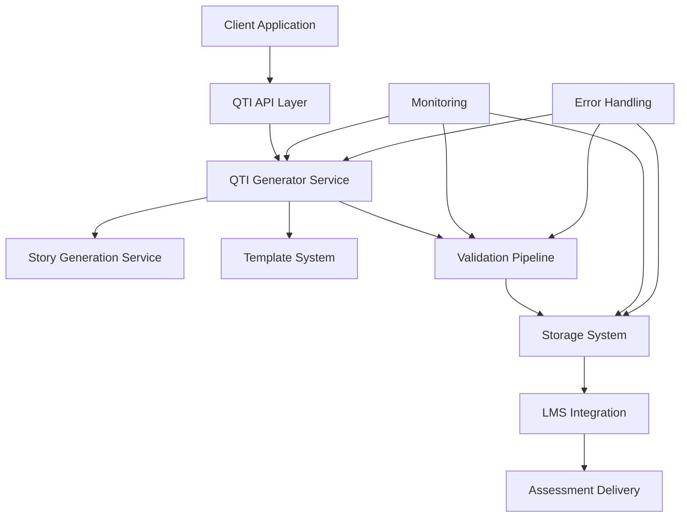

# QTI Integration Guide

**Version**: 1.0.0  
**Last Updated**: December 2024  
**Status**: ✅ PRODUCTION READY  

## 📋 **Overview**

This guide provides comprehensive instructions for integrating the QTI (Question & Test Interoperability) 3.0 package generation system with existing applications, services, and learning management systems. It covers API integration, deployment strategies, monitoring, and best practices for production environments.

## 🏗️ **Integration Architecture**

### **System Integration Overview**



### **Integration Patterns**

#### **1. Direct Integration**
Embed QTI generation directly in your application:

```typescript
import { QTIGenerator } from '@/lib/qti';

class AssessmentService {
  private qtiGenerator = new QTIGenerator();
  
  async createAssessment(storyId: string): Promise<string> {
    const story = await this.getStory(storyId);
    const qtiPackage = await this.qtiGenerator.generateValidatedPackage(story);
    return await this.savePackage(qtiPackage);
  }
}
```

#### **2. Service-Based Integration**
Create a dedicated QTI service:

```typescript
// qti-service.ts
export class QTIService {
  private generator = new QTIGenerator();
  
  async generatePackage(request: QTIGenerationRequest): Promise<QTIGenerationResponse> {
    try {
      const package = await this.generator.generateResilientPackage(
        request.story,
        request.options,
        request.fallbackLevel,
        request.enableValidation
      );
      
      return {
        success: true,
        packageId: package.identifier,
        package: package,
        validation: package.validation
      };
    } catch (error) {
      return {
        success: false,
        error: error.message,
        details: error.context
      };
    }
  }
}
```

#### **3. Microservice Integration**
Deploy as a standalone microservice:

```typescript
// qti-microservice.ts
import express from 'express';
import { QTIService } from './qti-service';

const app = express();
const qtiService = new QTIService();

app.post('/generate', async (req, res) => {
  const result = await qtiService.generatePackage(req.body);
  res.json(result);
});

app.listen(3000, () => {
  console.log('QTI Service running on port 3000');
});
```

## 🔌 **API Integration**

### **REST API Implementation**

#### **Complete API Server Setup**

```typescript
import express from 'express';
import cors from 'cors';
import helmet from 'helmet';
import rateLimit from 'express-rate-limit';
import { QTIGenerator, FallbackLevel } from '@/lib/qti';
import { logger } from './utils/logger';
import { authenticateRequest } from './middleware/auth';
import { validateStoryInput } from './middleware/validation';

const app = express();
const qtiGenerator = new QTIGenerator();

// Security middleware
app.use(helmet());
app.use(cors({
  origin: process.env.ALLOWED_ORIGINS?.split(',') || ['http://localhost:3000'],
  credentials: true
}));

// Rate limiting
const limiter = rateLimit({
  windowMs: 15 * 60 * 1000, // 15 minutes
  max: 100, // limit each IP to 100 requests per windowMs
  message: 'Too many requests from this IP'
});
app.use('/api/qti', limiter);

// Body parsing
app.use(express.json({ limit: '10mb' }));
app.use(express.urlencoded({ extended: true }));

// Middleware
app.use(authenticateRequest);

// Health check endpoint
app.get('/health', (req, res) => {
  res.json({ status: 'healthy', timestamp: new Date().toISOString() });
});

// Generate QTI package endpoint
app.post('/api/qti/generate', validateStoryInput, async (req, res) => {
  const startTime = Date.now();
  const requestId = req.headers['x-request-id'] || generateRequestId();
  
  try {
    logger.info('QTI generation request received', {
      requestId,
      userId: req.user?.id,
      storyTitle: req.body.story?.title
    });
    
    const { story, options = {}, fallbackLevel = 'STANDARD', enableValidation = true } = req.body;
    
    // Generate QTI package
    const qtiPackage = await qtiGenerator.generateResilientPackage(
      story,
      options,
      FallbackLevel[fallbackLevel as keyof typeof FallbackLevel],
      enableValidation
    );
    
    const duration = Date.now() - startTime;
    
    logger.info('QTI generation completed', {
      requestId,
      packageId: qtiPackage.identifier,
      duration,
      validationSuccess: qtiPackage.validation?.success
    });
    
    // Response
    res.json({
      success: true,
      requestId,
      package: {
        id: qtiPackage.identifier,
        title: story.title,
        itemCount: qtiPackage.assessmentItems.length,
        sectionCount: qtiPackage.assessmentTest.structure.sections.length,
        files: Object.keys(qtiPackage.files)
      },
      validation: qtiPackage.validation ? {
        success: qtiPackage.validation.success,
        complianceScore: qtiPackage.validation.complianceReport?.overallScore,
        errorCount: qtiPackage.validation.errors.length,
        warningCount: qtiPackage.validation.warnings.length
      } : null,
      performance: {
        generationTime: duration,
        memoryUsed: qtiPackage.performance?.memoryUsage.heapUsed
      },
      downloadUrl: `/api/qti/download/${qtiPackage.identifier}`
    });
    
  } catch (error) {
    const duration = Date.now() - startTime;
    
    logger.error('QTI generation failed', {
      requestId,
      error: error.message,
      stack: error.stack,
      duration
    });
    
    res.status(500).json({
      success: false,
      requestId,
      error: {
        message: error.message,
        type: error.constructor.name,
        code: error.code || 'GENERATION_ERROR'
      },
      performance: {
        generationTime: duration
      }
    });
  }
});

// Download QTI package endpoint
app.get('/api/qti/download/:packageId', async (req, res) => {
  try {
    const { packageId } = req.params;
    const { format = 'zip' } = req.query;
    
    // Retrieve package from storage
    const qtiPackage = await retrievePackage(packageId);
    
    if (!qtiPackage) {
      return res.status(404).json({ error: 'Package not found' });
    }
    
    if (format === 'zip') {
      // Create ZIP archive
      const zipBuffer = await createZipArchive(qtiPackage);
      res.set({
        'Content-Type': 'application/zip',
        'Content-Disposition': `attachment; filename="${packageId}.zip"`
      });
      res.send(zipBuffer);
    } else {
      // Return JSON
      res.json(qtiPackage);
    }
    
  } catch (error) {
    logger.error('Package download failed', { packageId: req.params.packageId, error: error.message });
    res.status(500).json({ error: 'Download failed' });
  }
});

// Package status endpoint
app.get('/api/qti/status/:packageId', async (req, res) => {
  try {
    const { packageId } = req.params;
    const status = await getPackageStatus(packageId);
    
    res.json({
      packageId,
      status: status.status,
      createdAt: status.createdAt,
      validationResults: status.validationResults,
      downloadCount: status.downloadCount
    });
    
  } catch (error) {
    res.status(404).json({ error: 'Package not found' });
  }
});

// List user's packages
app.get('/api/qti/packages', async (req, res) => {
  try {
    const userId = req.user.id;
    const { page = 1, limit = 20, status } = req.query;
    
    const packages = await getUserPackages(userId, {
      page: parseInt(page as string),
      limit: parseInt(limit as string),
      status: status as string
    });
    
    res.json({
      packages: packages.items,
      pagination: {
        page: packages.page,
        limit: packages.limit,
        total: packages.total,
        pages: Math.ceil(packages.total / packages.limit)
      }
    });
    
  } catch (error) {
    res.status(500).json({ error: 'Failed to retrieve packages' });
  }
});

// Validation endpoint
app.post('/api/qti/validate', async (req, res) => {
  try {
    const { xml, type = 'assessment-test' } = req.body;
    
    const validator = new QTIValidator();
    let result;
    
    switch (type) {
      case 'assessment-test':
        result = validator.validateAssessmentTest(xml);
        break;
      case 'assessment-item':
        result = validator.validateAssessmentItem(xml);
        break;
      case 'manifest':
        result = validator.validateManifest(xml);
        break;
      default:
        return res.status(400).json({ error: 'Invalid validation type' });
    }
    
    res.json({
      valid: result.isValid,
      errors: result.errors,
      warnings: result.warnings,
      metadata: result.metadata
    });
    
  } catch (error) {
    res.status(500).json({ error: 'Validation failed' });
  }
});

// Error handling middleware
app.use((error: Error, req: express.Request, res: express.Response, next: express.NextFunction) => {
  logger.error('Unhandled error', { error: error.message, stack: error.stack, url: req.url });
  res.status(500).json({ error: 'Internal server error' });
});

export default app;
```

#### **Client-Side Integration**

```typescript
// qti-client.ts
export class QTIClient {
  constructor(
    private baseUrl: string,
    private apiKey: string
  ) {}
  
  async generatePackage(
    story: StoryGenerationResponse,
    options?: QTIGenerationOptions
  ): Promise<QTIGenerationResult> {
    const response = await fetch(`${this.baseUrl}/api/qti/generate`, {
      method: 'POST',
      headers: {
        'Content-Type': 'application/json',
        'Authorization': `Bearer ${this.apiKey}`,
        'X-Request-ID': this.generateRequestId()
      },
      body: JSON.stringify({
        story,
        options,
        fallbackLevel: 'STANDARD',
        enableValidation: true
      })
    });
    
    if (!response.ok) {
      const error = await response.json();
      throw new Error(`QTI generation failed: ${error.error.message}`);
    }
    
    return await response.json();
  }
  
  async downloadPackage(packageId: string, format: 'zip' | 'json' = 'zip'): Promise<Blob | object> {
    const response = await fetch(`${this.baseUrl}/api/qti/download/${packageId}?format=${format}`, {
      headers: {
        'Authorization': `Bearer ${this.apiKey}`
      }
    });
    
    if (!response.ok) {
      throw new Error('Download failed');
    }
    
    return format === 'zip' ? await response.blob() : await response.json();
  }
  
  async getPackageStatus(packageId: string): Promise<PackageStatus> {
    const response = await fetch(`${this.baseUrl}/api/qti/status/${packageId}`, {
      headers: {
        'Authorization': `Bearer ${this.apiKey}`
      }
    });
    
    if (!response.ok) {
      throw new Error('Package not found');
    }
    
    return await response.json();
  }
  
  private generateRequestId(): string {
    return `req_${Date.now()}_${Math.random().toString(36).substring(2, 8)}`;
  }
}
```

### **GraphQL Integration**

```typescript
import { GraphQLObjectType, GraphQLSchema, GraphQLString, GraphQLBoolean, GraphQLInt, GraphQLList } from 'graphql';
import { QTIGenerator } from '@/lib/qti';

const qtiGenerator = new QTIGenerator();

// GraphQL Types
const QTIPackageType = new GraphQLObjectType({
  name: 'QTIPackage',
  fields: {
    id: { type: GraphQLString },
    title: { type: GraphQLString },
    itemCount: { type: GraphQLInt },
    sectionCount: { type: GraphQLInt },
    validationSuccess: { type: GraphQLBoolean },
    complianceScore: { type: GraphQLInt },
    downloadUrl: { type: GraphQLString }
  }
});

const ValidationResultType = new GraphQLObjectType({
  name: 'ValidationResult',
  fields: {
    success: { type: GraphQLBoolean },
    errorCount: { type: GraphQLInt },
    warningCount: { type: GraphQLInt },
    complianceScore: { type: GraphQLInt }
  }
});

// Mutations
const RootMutation = new GraphQLObjectType({
  name: 'Mutation',
  fields: {
    generateQTIPackage: {
      type: QTIPackageType,
      args: {
        story: { type: GraphQLString },
        options: { type: GraphQLString }
      },
      resolve: async (parent, args, context) => {
        try {
          const story = JSON.parse(args.story);
          const options = args.options ? JSON.parse(args.options) : {};
          
          const qtiPackage = await qtiGenerator.generateValidatedPackage(story, options);
          
          return {
            id: qtiPackage.identifier,
            title: story.title,
            itemCount: qtiPackage.assessmentItems.length,
            sectionCount: qtiPackage.assessmentTest.structure.sections.length,
            validationSuccess: qtiPackage.validation?.success || false,
            complianceScore: qtiPackage.validation?.complianceReport?.overallScore || 0,
            downloadUrl: `/download/${qtiPackage.identifier}`
          };
        } catch (error) {
          throw new Error(`QTI generation failed: ${error.message}`);
        }
      }
    }
  }
});

// Queries
const RootQuery = new GraphQLObjectType({
  name: 'Query',
  fields: {
    qtiPackage: {
      type: QTIPackageType,
      args: { id: { type: GraphQLString } },
      resolve: async (parent, args) => {
        return await getPackageById(args.id);
      }
    },
    userPackages: {
      type: new GraphQLList(QTIPackageType),
      args: { userId: { type: GraphQLString } },
      resolve: async (parent, args) => {
        return await getUserPackages(args.userId);
      }
    }
  }
});

export const schema = new GraphQLSchema({
  query: RootQuery,
  mutation: RootMutation
});
```

## 🗄️ **Database Integration**

### **Database Schema**

```sql
-- QTI Packages table
CREATE TABLE qti_packages (
    id VARCHAR(255) PRIMARY KEY,
    user_id VARCHAR(255) NOT NULL,
    story_id VARCHAR(255),
    title VARCHAR(500) NOT NULL,
    package_data JSONB NOT NULL,
    validation_results JSONB,
    compliance_score INTEGER DEFAULT 0,
    item_count INTEGER DEFAULT 0,
    section_count INTEGER DEFAULT 0,
    status VARCHAR(50) DEFAULT 'generated',
    created_at TIMESTAMP DEFAULT CURRENT_TIMESTAMP,
    updated_at TIMESTAMP DEFAULT CURRENT_TIMESTAMP,
    download_count INTEGER DEFAULT 0,
    last_downloaded_at TIMESTAMP,
    
    INDEX idx_user_id (user_id),
    INDEX idx_story_id (story_id),
    INDEX idx_status (status),
    INDEX idx_created_at (created_at),
    INDEX idx_compliance_score (compliance_score)
);

-- QTI Files table (for individual file storage)
CREATE TABLE qti_files (
    id VARCHAR(255) PRIMARY KEY,
    package_id VARCHAR(255) NOT NULL,
    filename VARCHAR(255) NOT NULL,
    content_type VARCHAR(100) DEFAULT 'application/xml',
    content LONGTEXT NOT NULL,
    file_size INTEGER DEFAULT 0,
    created_at TIMESTAMP DEFAULT CURRENT_TIMESTAMP,
    
    FOREIGN KEY (package_id) REFERENCES qti_packages(id) ON DELETE CASCADE,
    INDEX idx_package_id (package_id),
    INDEX idx_filename (filename)
);

-- QTI Generation Logs table
CREATE TABLE qti_generation_logs (
    id VARCHAR(255) PRIMARY KEY,
    package_id VARCHAR(255),
    user_id VARCHAR(255),
    request_id VARCHAR(255),
    story_title VARCHAR(500),
    generation_time INTEGER, -- milliseconds
    memory_used BIGINT,
    validation_enabled BOOLEAN DEFAULT FALSE,
    fallback_level VARCHAR(50),
    success BOOLEAN NOT NULL,
    error_message TEXT,
    error_type VARCHAR(100),
    created_at TIMESTAMP DEFAULT CURRENT_TIMESTAMP,
    
    FOREIGN KEY (package_id) REFERENCES qti_packages(id) ON DELETE SET NULL,
    INDEX idx_user_id (user_id),
    INDEX idx_success (success),
    INDEX idx_created_at (created_at),
    INDEX idx_request_id (request_id)
);
```

### **Database Service Implementation**

```typescript
import { Pool } from 'pg';
import { GeneratedQTIPackage } from '@/lib/qti';

export class QTIDatabase {
  constructor(private pool: Pool) {}
  
  async savePackage(
    userId: string,
    storyId: string | null,
    qtiPackage: GeneratedQTIPackage
  ): Promise<string> {
    const client = await this.pool.connect();
    
    try {
      await client.query('BEGIN');
      
      // Insert package record
      await client.query(`
        INSERT INTO qti_packages (
          id, user_id, story_id, title, package_data, validation_results,
          compliance_score, item_count, section_count, status
        ) VALUES ($1, $2, $3, $4, $5, $6, $7, $8, $9, $10)
      `, [
        qtiPackage.identifier,
        userId,
        storyId,
        qtiPackage.assessmentTest.structure.title,
        JSON.stringify(qtiPackage),
        JSON.stringify(qtiPackage.validation),
        qtiPackage.validation?.complianceReport?.overallScore || 0,
        qtiPackage.assessmentItems.length,
        qtiPackage.assessmentTest.structure.sections.length,
        'generated'
      ]);
      
      // Insert individual files
      for (const [filename, content] of Object.entries(qtiPackage.files)) {
        await client.query(`
          INSERT INTO qti_files (id, package_id, filename, content_type, content, file_size)
          VALUES ($1, $2, $3, $4, $5, $6)
        `, [
          `${qtiPackage.identifier}_${filename}`,
          qtiPackage.identifier,
          filename,
          filename.endsWith('.xml') ? 'application/xml' : 'text/plain',
          content,
          content.length
        ]);
      }
      
      await client.query('COMMIT');
      return qtiPackage.identifier;
      
    } catch (error) {
      await client.query('ROLLBACK');
      throw error;
    } finally {
      client.release();
    }
  }
  
  async getPackage(packageId: string): Promise<GeneratedQTIPackage | null> {
    const result = await this.pool.query(
      'SELECT package_data FROM qti_packages WHERE id = $1',
      [packageId]
    );
    
    if (result.rows.length === 0) {
      return null;
    }
    
    return result.rows[0].package_data;
  }
  
  async getUserPackages(
    userId: string,
    options: { page: number; limit: number; status?: string }
  ): Promise<{ items: any[]; total: number; page: number; limit: number }> {
    const offset = (options.page - 1) * options.limit;
    
    let whereClause = 'WHERE user_id = $1';
    const params: any[] = [userId];
    
    if (options.status) {
      whereClause += ' AND status = $2';
      params.push(options.status);
    }
    
    // Get total count
    const countResult = await this.pool.query(
      `SELECT COUNT(*) FROM qti_packages ${whereClause}`,
      params
    );
    const total = parseInt(countResult.rows[0].count);
    
    // Get packages
    const result = await this.pool.query(`
      SELECT id, title, item_count, section_count, compliance_score, 
             status, created_at, download_count
      FROM qti_packages 
      ${whereClause}
      ORDER BY created_at DESC 
      LIMIT $${params.length + 1} OFFSET $${params.length + 2}
    `, [...params, options.limit, offset]);
    
    return {
      items: result.rows,
      total,
      page: options.page,
      limit: options.limit
    };
  }
  
  async logGeneration(logData: {
    packageId?: string;
    userId: string;
    requestId: string;
    storyTitle: string;
    generationTime: number;
    memoryUsed?: number;
    validationEnabled: boolean;
    fallbackLevel: string;
    success: boolean;
    errorMessage?: string;
    errorType?: string;
  }): Promise<void> {
    await this.pool.query(`
      INSERT INTO qti_generation_logs (
        id, package_id, user_id, request_id, story_title, generation_time,
        memory_used, validation_enabled, fallback_level, success, error_message, error_type
      ) VALUES ($1, $2, $3, $4, $5, $6, $7, $8, $9, $10, $11, $12)
    `, [
      `log_${Date.now()}_${Math.random().toString(36).substring(2, 8)}`,
      logData.packageId,
      logData.userId,
      logData.requestId,
      logData.storyTitle,
      logData.generationTime,
      logData.memoryUsed,
      logData.validationEnabled,
      logData.fallbackLevel,
      logData.success,
      logData.errorMessage,
      logData.errorType
    ]);
  }
  
  async updateDownloadCount(packageId: string): Promise<void> {
    await this.pool.query(`
      UPDATE qti_packages 
      SET download_count = download_count + 1, last_downloaded_at = CURRENT_TIMESTAMP
      WHERE id = $1
    `, [packageId]);
  }
}
```

## ☁️ **Cloud Storage Integration**

### **AWS S3 Integration**

```typescript
import AWS from 'aws-sdk';
import { GeneratedQTIPackage } from '@/lib/qti';

export class S3QTIStorage {
  private s3: AWS.S3;
  
  constructor(
    private bucketName: string,
    private region: string = 'us-east-1'
  ) {
    this.s3 = new AWS.S3({ region: this.region });
  }
  
  async storePackage(qtiPackage: GeneratedQTIPackage): Promise<string> {
    const packageKey = `qti-packages/${qtiPackage.identifier}`;
    
    try {
      // Store package metadata
      await this.s3.putObject({
        Bucket: this.bucketName,
        Key: `${packageKey}/package.json`,
        Body: JSON.stringify(qtiPackage, null, 2),
        ContentType: 'application/json',
        Metadata: {
          packageId: qtiPackage.identifier,
          title: qtiPackage.assessmentTest.structure.title,
          itemCount: qtiPackage.assessmentItems.length.toString(),
          complianceScore: (qtiPackage.validation?.complianceReport?.overallScore || 0).toString()
        }
      }).promise();
      
      // Store individual files
      const uploadPromises = Object.entries(qtiPackage.files).map(([filename, content]) =>
        this.s3.putObject({
          Bucket: this.bucketName,
          Key: `${packageKey}/files/${filename}`,
          Body: content,
          ContentType: filename.endsWith('.xml') ? 'application/xml' : 'text/plain'
        }).promise()
      );
      
      await Promise.all(uploadPromises);
      
      // Create ZIP archive and store
      const zipBuffer = await this.createZipArchive(qtiPackage);
      await this.s3.putObject({
        Bucket: this.bucketName,
        Key: `${packageKey}/package.zip`,
        Body: zipBuffer,
        ContentType: 'application/zip'
      }).promise();
      
      return `s3://${this.bucketName}/${packageKey}`;
      
    } catch (error) {
      throw new Error(`Failed to store package in S3: ${error.message}`);
    }
  }
  
  async retrievePackage(packageId: string): Promise<GeneratedQTIPackage | null> {
    try {
      const response = await this.s3.getObject({
        Bucket: this.bucketName,
        Key: `qti-packages/${packageId}/package.json`
      }).promise();
      
      if (!response.Body) {
        return null;
      }
      
      return JSON.parse(response.Body.toString());
      
    } catch (error) {
      if (error.code === 'NoSuchKey') {
        return null;
      }
      throw error;
    }
  }
  
  async getDownloadUrl(packageId: string, format: 'zip' | 'json' = 'zip'): Promise<string> {
    const key = format === 'zip' 
      ? `qti-packages/${packageId}/package.zip`
      : `qti-packages/${packageId}/package.json`;
    
    return this.s3.getSignedUrl('getObject', {
      Bucket: this.bucketName,
      Key: key,
      Expires: 3600 // 1 hour
    });
  }
  
  private async createZipArchive(qtiPackage: GeneratedQTIPackage): Promise<Buffer> {
    const JSZip = require('jszip');
    const zip = new JSZip();
    
    // Add all files to ZIP
    Object.entries(qtiPackage.files).forEach(([filename, content]) => {
      zip.file(filename, content);
    });
    
    // Add package metadata
    zip.file('package-info.json', JSON.stringify({
      id: qtiPackage.identifier,
      title: qtiPackage.assessmentTest.structure.title,
      itemCount: qtiPackage.assessmentItems.length,
      sectionCount: qtiPackage.assessmentTest.structure.sections.length,
      validation: qtiPackage.validation,
      generatedAt: new Date().toISOString()
    }, null, 2));
    
    return await zip.generateAsync({ type: 'nodebuffer' });
  }
}
```

### **Google Cloud Storage Integration**

```typescript
import { Storage } from '@google-cloud/storage';
import { GeneratedQTIPackage } from '@/lib/qti';

export class GCSQTIStorage {
  private storage: Storage;
  private bucket: any;
  
  constructor(
    private bucketName: string,
    private projectId: string
  ) {
    this.storage = new Storage({ projectId: this.projectId });
    this.bucket = this.storage.bucket(this.bucketName);
  }
  
  async storePackage(qtiPackage: GeneratedQTIPackage): Promise<string> {
    const packagePrefix = `qti-packages/${qtiPackage.identifier}`;
    
    try {
      // Store package JSON
      const packageFile = this.bucket.file(`${packagePrefix}/package.json`);
      await packageFile.save(JSON.stringify(qtiPackage, null, 2), {
        metadata: {
          contentType: 'application/json',
          metadata: {
            packageId: qtiPackage.identifier,
            title: qtiPackage.assessmentTest.structure.title,
            itemCount: qtiPackage.assessmentItems.length.toString()
          }
        }
      });
      
      // Store individual files
      const uploadPromises = Object.entries(qtiPackage.files).map(([filename, content]) => {
        const file = this.bucket.file(`${packagePrefix}/files/${filename}`);
        return file.save(content, {
          metadata: {
            contentType: filename.endsWith('.xml') ? 'application/xml' : 'text/plain'
          }
        });
      });
      
      await Promise.all(uploadPromises);
      
      return `gs://${this.bucketName}/${packagePrefix}`;
      
    } catch (error) {
      throw new Error(`Failed to store package in GCS: ${error.message}`);
    }
  }
  
  async retrievePackage(packageId: string): Promise<GeneratedQTIPackage | null> {
    try {
      const file = this.bucket.file(`qti-packages/${packageId}/package.json`);
      const [exists] = await file.exists();
      
      if (!exists) {
        return null;
      }
      
      const [contents] = await file.download();
      return JSON.parse(contents.toString());
      
    } catch (error) {
      return null;
    }
  }
  
  async getSignedUrl(packageId: string, format: 'zip' | 'json' = 'zip'): Promise<string> {
    const filename = format === 'zip' ? 'package.zip' : 'package.json';
    const file = this.bucket.file(`qti-packages/${packageId}/${filename}`);
    
    const [url] = await file.getSignedUrl({
      action: 'read',
      expires: Date.now() + 3600000 // 1 hour
    });
    
    return url;
  }
}
```

## 🎓 **LMS Integration**

### **Moodle Integration**

```typescript
export class MoodleQTIIntegration {
  constructor(
    private moodleUrl: string,
    private apiToken: string
  ) {}
  
  async uploadQTIPackage(
    qtiPackage: GeneratedQTIPackage,
    courseId: number
  ): Promise<string> {
    try {
      // Create ZIP package for Moodle
      const zipBuffer = await this.createMoodleCompatibleZip(qtiPackage);
      
      // Upload to Moodle
      const formData = new FormData();
      formData.append('file', new Blob([zipBuffer]), `${qtiPackage.identifier}.zip`);
      formData.append('courseid', courseId.toString());
      formData.append('wstoken', this.apiToken);
      formData.append('wsfunction', 'core_files_upload');
      
      const response = await fetch(`${this.moodleUrl}/webservice/rest/server.php`, {
        method: 'POST',
        body: formData
      });
      
      const result = await response.json();
      
      if (result.error) {
        throw new Error(`Moodle upload failed: ${result.error}`);
      }
      
      // Import as quiz
      return await this.importAsQuiz(result.itemid, courseId, qtiPackage.assessmentTest.structure.title);
      
    } catch (error) {
      throw new Error(`Moodle integration failed: ${error.message}`);
    }
  }
  
  private async createMoodleCompatibleZip(qtiPackage: GeneratedQTIPackage): Promise<Buffer> {
    const JSZip = require('jszip');
    const zip = new JSZip();
    
    // Moodle expects specific structure
    zip.file('imsmanifest.xml', qtiPackage.files['imsmanifest.xml']);
    zip.file('assessment-test.xml', qtiPackage.files['assessment-test.xml']);
    
    // Add assessment items
    qtiPackage.assessmentItems.forEach((item, index) => {
      zip.file(`${item.identifier}.xml`, qtiPackage.files[`${item.identifier}.xml`]);
    });
    
    return await zip.generateAsync({ type: 'nodebuffer' });
  }
  
  private async importAsQuiz(itemId: number, courseId: number, quizName: string): Promise<string> {
    const response = await fetch(`${this.moodleUrl}/webservice/rest/server.php`, {
      method: 'POST',
      headers: {
        'Content-Type': 'application/x-www-form-urlencoded'
      },
      body: new URLSearchParams({
        wstoken: this.apiToken,
        wsfunction: 'mod_quiz_import_questions',
        courseid: courseId.toString(),
        categoryid: '0', // Default category
        itemid: itemId.toString(),
        format: 'qti2',
        name: quizName
      })
    });
    
    const result = await response.json();
    return result.quizid;
  }
}
```

### **Canvas Integration**

```typescript
export class CanvasQTIIntegration {
  constructor(
    private canvasUrl: string,
    private accessToken: string
  ) {}
  
  async uploadQTIPackage(
    qtiPackage: GeneratedQTIPackage,
    courseId: number
  ): Promise<string> {
    try {
      // Step 1: Upload QTI package
      const uploadUrl = await this.getUploadUrl(courseId);
      const zipBuffer = await this.createCanvasCompatibleZip(qtiPackage);
      
      const fileResponse = await fetch(uploadUrl.upload_url, {
        method: 'POST',
        body: this.createUploadFormData(zipBuffer, uploadUrl.upload_params)
      });
      
      // Step 2: Import as quiz
      const importResponse = await fetch(
        `${this.canvasUrl}/api/v1/courses/${courseId}/content_migrations`,
        {
          method: 'POST',
          headers: {
            'Authorization': `Bearer ${this.accessToken}`,
            'Content-Type': 'application/json'
          },
          body: JSON.stringify({
            migration_type: 'qti_converter',
            settings: {
              file_url: fileResponse.url,
              question_bank_name: qtiPackage.assessmentTest.structure.title
            }
          })
        }
      );
      
      const importResult = await importResponse.json();
      return importResult.id;
      
    } catch (error) {
      throw new Error(`Canvas integration failed: ${error.message}`);
    }
  }
  
  private async getUploadUrl(courseId: number): Promise<any> {
    const response = await fetch(
      `${this.canvasUrl}/api/v1/courses/${courseId}/files`,
      {
        method: 'POST',
        headers: {
          'Authorization': `Bearer ${this.accessToken}`,
          'Content-Type': 'application/json'
        },
        body: JSON.stringify({
          name: 'qti-package.zip',
          size: 0, // Will be updated
          content_type: 'application/zip'
        })
      }
    );
    
    return await response.json();
  }
  
  private createUploadFormData(zipBuffer: Buffer, uploadParams: any): FormData {
    const formData = new FormData();
    
    // Add Canvas upload parameters
    Object.entries(uploadParams).forEach(([key, value]) => {
      formData.append(key, value as string);
    });
    
    // Add file
    formData.append('file', new Blob([zipBuffer]), 'qti-package.zip');
    
    return formData;
  }
  
  private async createCanvasCompatibleZip(qtiPackage: GeneratedQTIPackage): Promise<Buffer> {
    const JSZip = require('jszip');
    const zip = new JSZip();
    
    // Canvas QTI structure
    zip.file('imsmanifest.xml', qtiPackage.files['imsmanifest.xml']);
    zip.file('assessment_qti.xml', qtiPackage.files['assessment-test.xml']);
    
    // Add items with Canvas naming convention
    qtiPackage.assessmentItems.forEach((item, index) => {
      zip.file(`assessment_question_${index + 1}.xml`, qtiPackage.files[`${item.identifier}.xml`]);
    });
    
    return await zip.generateAsync({ type: 'nodebuffer' });
  }
}
```

## 📊 **Monitoring & Analytics**

### **Performance Monitoring**

```typescript
import { EventEmitter } from 'events';

export class QTIMonitor extends EventEmitter {
  private metrics = new Map<string, any>();
  
  constructor() {
    super();
    this.startMetricsCollection();
  }
  
  recordGeneration(data: {
    packageId: string;
    userId: string;
    generationTime: number;
    memoryUsed: number;
    validationEnabled: boolean;
    success: boolean;
    errorType?: string;
  }): void {
    // Record metrics
    this.updateMetric('total_generations', 1);
    this.updateMetric('generation_time', data.generationTime);
    this.updateMetric('memory_usage', data.memoryUsed);
    
    if (data.success) {
      this.updateMetric('successful_generations', 1);
    } else {
      this.updateMetric('failed_generations', 1);
      this.updateMetric(`error_${data.errorType}`, 1);
    }
    
    // Emit event for external monitoring
    this.emit('generation_completed', data);
  }
  
  recordValidation(data: {
    packageId: string;
    validationTime: number;
    complianceScore: number;
    errorCount: number;
    warningCount: number;
  }): void {
    this.updateMetric('total_validations', 1);
    this.updateMetric('validation_time', data.validationTime);
    this.updateMetric('compliance_scores', data.complianceScore);
    this.updateMetric('validation_errors', data.errorCount);
    this.updateMetric('validation_warnings', data.warningCount);
    
    this.emit('validation_completed', data);
  }
  
  recordDownload(data: {
    packageId: string;
    userId: string;
    format: string;
    downloadTime: number;
  }): void {
    this.updateMetric('total_downloads', 1);
    this.updateMetric(`downloads_${data.format}`, 1);
    this.updateMetric('download_time', data.downloadTime);
    
    this.emit('package_downloaded', data);
  }
  
  getMetrics(): Record<string, any> {
    const result: Record<string, any> = {};
    
    this.metrics.forEach((value, key) => {
      if (Array.isArray(value)) {
        result[key] = {
          total: value.length,
          average: value.reduce((sum, v) => sum + v, 0) / value.length,
          min: Math.min(...value),
          max: Math.max(...value)
        };
      } else {
        result[key] = value;
      }
    });
    
    return result;
  }
  
  private updateMetric(key: string, value: number): void {
    if (key.includes('_time') || key.includes('_usage') || key.includes('_score')) {
      // Store arrays for time/usage metrics to calculate averages
      if (!this.metrics.has(key)) {
        this.metrics.set(key, []);
      }
      this.metrics.get(key).push(value);
      
      // Keep only last 1000 values
      const values = this.metrics.get(key);
      if (values.length > 1000) {
        values.shift();
      }
    } else {
      // Simple counters
      this.metrics.set(key, (this.metrics.get(key) || 0) + value);
    }
  }
  
  private startMetricsCollection(): void {
    // Collect system metrics every minute
    setInterval(() => {
      const memUsage = process.memoryUsage();
      this.updateMetric('system_memory_heap', memUsage.heapUsed);
      this.updateMetric('system_memory_rss', memUsage.rss);
      
      this.emit('metrics_collected', this.getMetrics());
    }, 60000);
  }
}

// Global monitor instance
export const qtiMonitor = new QTIMonitor();
```

### **Error Tracking Integration**

```typescript
import * as Sentry from '@sentry/node';

export class QTIErrorTracking {
  constructor() {
    // Initialize Sentry or other error tracking
    Sentry.init({
      dsn: process.env.SENTRY_DSN,
      environment: process.env.NODE_ENV,
      beforeSend(event, hint) {
        // Filter QTI-specific errors
        if (event.tags?.component === 'qti') {
          return event;
        }
        return null;
      }
    });
  }
  
  captureGenerationError(error: Error, context: {
    packageId?: string;
    userId: string;
    storyTitle: string;
    options: any;
  }): void {
    Sentry.withScope(scope => {
      scope.setTag('component', 'qti');
      scope.setTag('operation', 'generation');
      scope.setContext('qti_context', context);
      scope.setLevel('error');
      
      Sentry.captureException(error);
    });
  }
  
  captureValidationError(error: Error, context: {
    packageId: string;
    validationType: string;
    xmlLength: number;
  }): void {
    Sentry.withScope(scope => {
      scope.setTag('component', 'qti');
      scope.setTag('operation', 'validation');
      scope.setContext('validation_context', context);
      scope.setLevel('warning');
      
      Sentry.captureException(error);
    });
  }
  
  capturePerformanceData(data: {
    operation: string;
    duration: number;
    memoryUsed: number;
    success: boolean;
  }): void {
    const transaction = Sentry.startTransaction({
      name: `qti_${data.operation}`,
      op: 'qti'
    });
    
    transaction.setData('duration', data.duration);
    transaction.setData('memory_used', data.memoryUsed);
    transaction.setData('success', data.success);
    
    transaction.finish();
  }
}
```

## 🚀 **Deployment Strategies**

### **Docker Deployment**

```dockerfile
# Dockerfile
FROM node:18-alpine

WORKDIR /app

# Copy package files
COPY package*.json ./
COPY tsconfig.json ./

# Install dependencies
RUN npm ci --only=production

# Copy source code
COPY src/ ./src/
COPY templates/ ./templates/
COPY schemas/ ./schemas/

# Build TypeScript
RUN npm run build

# Create non-root user
RUN addgroup -g 1001 -S nodejs
RUN adduser -S qti -u 1001

# Change to non-root user
USER qti

# Expose port
EXPOSE 3000

# Health check
HEALTHCHECK --interval=30s --timeout=3s --start-period=5s --retries=3 \
  CMD curl -f http://localhost:3000/health || exit 1

# Start application
CMD ["node", "dist/server.js"]
```

```yaml
# docker-compose.yml
version: '3.8'

services:
  qti-service:
    build: .
    ports:
      - "3000:3000"
    environment:
      - NODE_ENV=production
      - DATABASE_URL=${DATABASE_URL}
      - REDIS_URL=${REDIS_URL}
      - QTI_TEMPLATE_PATH=/app/templates
      - QTI_SCHEMA_PATH=/app/schemas
    volumes:
      - ./templates:/app/templates:ro
      - ./schemas:/app/schemas:ro
    depends_on:
      - postgres
      - redis
    restart: unless-stopped
    
  postgres:
    image: postgres:15-alpine
    environment:
      - POSTGRES_DB=qti_db
      - POSTGRES_USER=${DB_USER}
      - POSTGRES_PASSWORD=${DB_PASSWORD}
    volumes:
      - postgres_data:/var/lib/postgresql/data
    restart: unless-stopped
    
  redis:
    image: redis:7-alpine
    volumes:
      - redis_data:/data
    restart: unless-stopped
    
  nginx:
    image: nginx:alpine
    ports:
      - "80:80"
      - "443:443"
    volumes:
      - ./nginx.conf:/etc/nginx/nginx.conf:ro
      - ./ssl:/etc/nginx/ssl:ro
    depends_on:
      - qti-service
    restart: unless-stopped

volumes:
  postgres_data:
  redis_data:
```

### **Kubernetes Deployment**

```yaml
# k8s/deployment.yaml
apiVersion: apps/v1
kind: Deployment
metadata:
  name: qti-service
  labels:
    app: qti-service
spec:
  replicas: 3
  selector:
    matchLabels:
      app: qti-service
  template:
    metadata:
      labels:
        app: qti-service
    spec:
      containers:
      - name: qti-service
        image: qti-service:latest
        ports:
        - containerPort: 3000
        env:
        - name: NODE_ENV
          value: "production"
        - name: DATABASE_URL
          valueFrom:
            secretKeyRef:
              name: qti-secrets
              key: database-url
        resources:
          requests:
            memory: "512Mi"
            cpu: "250m"
          limits:
            memory: "1Gi"
            cpu: "500m"
        livenessProbe:
          httpGet:
            path: /health
            port: 3000
          initialDelaySeconds: 30
          periodSeconds: 10
        readinessProbe:
          httpGet:
            path: /health
            port: 3000
          initialDelaySeconds: 5
          periodSeconds: 5
---
apiVersion: v1
kind: Service
metadata:
  name: qti-service
spec:
  selector:
    app: qti-service
  ports:
  - protocol: TCP
    port: 80
    targetPort: 3000
  type: ClusterIP
---
apiVersion: networking.k8s.io/v1
kind: Ingress
metadata:
  name: qti-ingress
  annotations:
    nginx.ingress.kubernetes.io/rewrite-target: /
    nginx.ingress.kubernetes.io/ssl-redirect: "true"
spec:
  tls:
  - hosts:
    - qti.example.com
    secretName: qti-tls
  rules:
  - host: qti.example.com
    http:
      paths:
      - path: /
        pathType: Prefix
        backend:
          service:
            name: qti-service
            port:
              number: 80
```

### **Serverless Deployment (AWS Lambda)**

```typescript
// lambda-handler.ts
import { APIGatewayProxyHandler } from 'aws-lambda';
import { QTIGenerator } from '@/lib/qti';

const qtiGenerator = new QTIGenerator();

export const handler: APIGatewayProxyHandler = async (event, context) => {
  try {
    const { story, options } = JSON.parse(event.body || '{}');
    
    const qtiPackage = await qtiGenerator.generateResilientPackage(
      story,
      options,
      'STANDARD',
      true
    );
    
    return {
      statusCode: 200,
      headers: {
        'Content-Type': 'application/json',
        'Access-Control-Allow-Origin': '*'
      },
      body: JSON.stringify({
        success: true,
        packageId: qtiPackage.identifier,
        validation: qtiPackage.validation
      })
    };
    
  } catch (error) {
    return {
      statusCode: 500,
      headers: {
        'Content-Type': 'application/json',
        'Access-Control-Allow-Origin': '*'
      },
      body: JSON.stringify({
        success: false,
        error: error.message
      })
    };
  }
};
```

```yaml
# serverless.yml
service: qti-service

provider:
  name: aws
  runtime: nodejs18.x
  region: us-east-1
  timeout: 30
  memorySize: 1024
  environment:
    NODE_ENV: production
    QTI_TEMPLATE_PATH: ./templates
    QTI_SCHEMA_PATH: ./schemas

functions:
  generateQTI:
    handler: dist/lambda-handler.handler
    events:
      - http:
          path: /generate
          method: post
          cors: true
    layers:
      - arn:aws:lambda:us-east-1:123456789:layer:qti-dependencies:1

plugins:
  - serverless-typescript
  - serverless-offline

package:
  include:
    - dist/**
    - templates/**
    - schemas/**
  exclude:
    - src/**
    - test/**
    - node_modules/**
```

## 📋 **Best Practices**

### **Security Best Practices**

1. **Input Validation**
   - Validate all story content before processing
   - Sanitize user inputs to prevent XSS attacks
   - Implement rate limiting to prevent abuse

2. **Authentication & Authorization**
   - Use JWT tokens for API authentication
   - Implement role-based access control
   - Log all access attempts

3. **Data Protection**
   - Encrypt sensitive data at rest
   - Use HTTPS for all communications
   - Implement proper session management

### **Performance Best Practices**

1. **Caching Strategy**
   - Cache templates and schemas
   - Implement Redis for session caching
   - Use CDN for static assets

2. **Resource Management**
   - Monitor memory usage
   - Implement connection pooling
   - Use load balancing for high availability

3. **Optimization**
   - Enable compression for API responses
   - Implement pagination for large datasets
   - Use background jobs for heavy processing

### **Monitoring Best Practices**

1. **Logging**
   - Implement structured logging
   - Log all API requests and responses
   - Monitor error rates and patterns

2. **Metrics**
   - Track generation performance
   - Monitor validation success rates
   - Measure user engagement

3. **Alerting**
   - Set up alerts for high error rates
   - Monitor system resource usage
   - Track API response times

---

## 📚 **Related Documentation**

- [QTI Technical Architecture](./QTI_TECHNICAL_ARCHITECTURE_DOCUMENTATION.md)
- [QTI API Reference](./QTI_API_REFERENCE.md)
- [QTI User Guide](./QTI_USER_GUIDE.md)
- [QTI Troubleshooting Guide](./QTI_TROUBLESHOOTING_GUIDE.md)

---

**Document Status**: ✅ **COMPLETE** - Comprehensive integration guide covering API integration, database setup, cloud storage, LMS integration, monitoring, and deployment strategies.