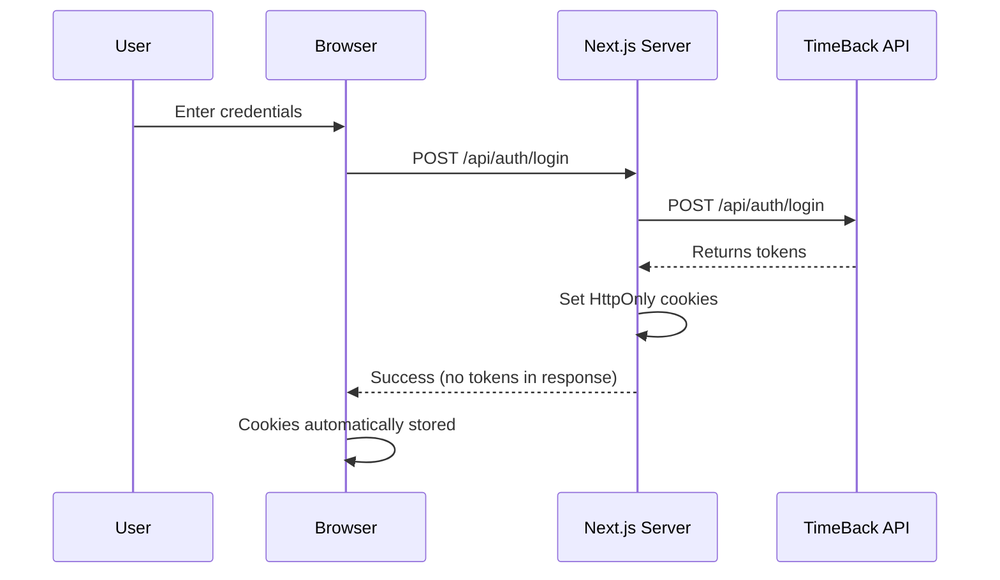
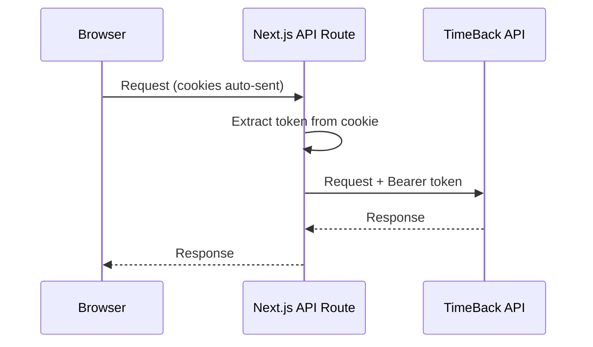

# Authentication Architecture Documentation
## Teaching Tales Application

**Version**: 1.0  
**Last Updated**: August 2025  
**Security Level**: High (HttpOnly Cookies + Server-Side Proxy)

---

## 🔐 Core Authentication Principle

**All authentication in Teaching Tales is handled server-side using secure HttpOnly cookies. Client-side JavaScript NEVER has access to authentication tokens.**

This approach provides maximum security against XSS (Cross-Site Scripting) attacks while maintaining a seamless user experience.

---

## 📋 Table of Contents

1. [Overview](#overview)
2. [Authentication Flow](#authentication-flow)
3. [Token Storage](#token-storage)
4. [API Request Pattern](#api-request-pattern)
5. [Implementation Guidelines](#implementation-guidelines)
6. [Security Benefits](#security-benefits)
7. [Migration Guide](#migration-guide)
8. [FAQ](#faq)

---

## Overview

Teaching Tales uses a **server-side proxy pattern** for all API communications:

```
Browser → Next.js API Route → TimeBack API → Response
         ↑                  ↑
         |                  |
    No tokens here     Tokens attached here
```

### Key Components

1. **TimeBack API**: External authentication and data provider (port 8080)
2. **Next.js API Routes**: Server-side proxy endpoints that handle authentication
3. **HttpOnly Cookies**: Secure token storage mechanism
4. **Client Application**: React frontend that makes requests without handling tokens

---

## Authentication Flow

### 1. Login Process



**Implementation**: `/src/app/api/auth/login/route.ts`

```typescript
// Server-side login handler
export async function POST(request: NextRequest) {
  const { email, password } = await request.json();
  
  // 1. Authenticate with TimeBack
  const response = await fetch(`${TIMEBACK_API}/api/auth/login`, {
    method: 'POST',
    body: JSON.stringify({ email, password })
  });
  
  // 2. Store tokens in HttpOnly cookies (server-side only)
  const { accessToken, refreshToken } = response.data;
  cookies().set('timeback-access-token', accessToken, {
    httpOnly: true,  // Cannot be accessed by JavaScript
    secure: true,     // HTTPS only in production
    sameSite: 'lax',  // CSRF protection
    maxAge: 3600      // 1 hour
  });
  
  // 3. Return success WITHOUT tokens
  return NextResponse.json({ success: true, user: userData });
}
```

### 2. Authenticated Requests

All authenticated API calls follow this pattern:



---

## Token Storage

### What We Store

| Token | Cookie Name | Type | Lifespan | Purpose |
|-------|------------|------|----------|---------|
| Access Token | `timeback-access-token` | HttpOnly | 1 hour | API authentication |
| ID Token | `timeback-id-token` | HttpOnly | 1 hour | User identity |
| Refresh Token | `timeback-refresh-token` | HttpOnly | 30 days | Token renewal |

### Cookie Settings

```typescript
const cookieOptions = {
  httpOnly: true,                    // Prevents JavaScript access
  secure: process.env.NODE_ENV === 'production',  // HTTPS only in production
  sameSite: 'lax',                  // CSRF protection
  path: '/',                        // Available to all routes
  maxAge: expiresIn || 3600         // Token expiration
};
```

### What We DON'T Do

❌ **Never store tokens in:**
- localStorage
- sessionStorage
- Regular cookies (non-HttpOnly)
- React state
- Global variables

---

## API Request Pattern

### Client-Side Code

Client code makes requests to Next.js API routes without handling tokens:

```typescript
// ✅ CORRECT: Client code
async function createStudent(studentData) {
  const response = await fetch('/api/ims/oneroster/rostering/v1p2/users', {
    method: 'POST',
    headers: { 'Content-Type': 'application/json' },
    credentials: 'include',  // Important: includes cookies
    body: JSON.stringify(studentData)
  });
  return response.json();
}

// ❌ WRONG: Don't do this
async function createStudent(studentData) {
  const token = getTokenSomehow();  // Don't access tokens client-side!
  const response = await fetch('http://localhost:8080/ims/oneroster/...', {
    headers: { 'Authorization': `Bearer ${token}` }
  });
}
```

### Server-Side Proxy Route

Each external API endpoint needs a corresponding Next.js API route:

```typescript
// /src/app/api/ims/oneroster/rostering/v1p2/users/route.ts
export async function POST(request: NextRequest) {
  // 1. Get token from cookie (server-side only)
  const cookieStore = await cookies();
  const token = cookieStore.get('timeback-access-token')?.value;
  
  if (!token) {
    return NextResponse.json(
      { error: 'Unauthorized' },
      { status: 401 }
    );
  }
  
  // 2. Forward request to TimeBack with token
  const body = await request.json();
  const response = await fetch(`${TIMEBACK_API}/ims/oneroster/rostering/v1p2/users`, {
    method: 'POST',
    headers: {
      'Authorization': `Bearer ${token}`,
      'Content-Type': 'application/json'
    },
    body: JSON.stringify(body)
  });
  
  // 3. Return response to client
  const data = await response.json();
  return NextResponse.json(data);
}
```

---

## Implementation Guidelines

### Creating New API Endpoints

When adding new functionality that requires TimeBack API access:

1. **Create a Next.js API route** in `/src/app/api/`
2. **Mirror the TimeBack API structure** for consistency
3. **Extract token from cookies** server-side
4. **Forward request** to TimeBack with authentication
5. **Return response** to client without exposing tokens

### Directory Structure

```
src/app/api/
├── auth/
│   ├── login/route.ts       # Proxy to TimeBack /api/auth/login
│   ├── logout/route.ts      # Proxy to TimeBack /api/auth/logout
│   ├── me/route.ts          # Proxy to TimeBack /api/auth/me
│   └── refresh/route.ts     # Proxy to TimeBack /api/auth/refresh
└── ims/
    ├── oneroster/
    │   └── rostering/
    │       └── v1p2/
    │           ├── users/route.ts              # Collection endpoints
    │           ├── users/[id]/route.ts         # Individual resource
    │           ├── classes/route.ts
    │           ├── orgs/route.ts
    │           └── ...
    └── qti/
        └── v3p0/
            ├── assessment-tests/route.ts
            └── ...
```

### Client-Side API Client

The API client should use relative URLs that route through Next.js:

```typescript
// src/lib/api-client.ts
class ApiClient {
  constructor() {
    this.client = axios.create({
      baseURL: '/api',              // Relative URL, goes through Next.js
      withCredentials: true,        // Include cookies in requests
      timeout: 30000,
      headers: {
        'Content-Type': 'application/json',
      }
    });
  }
  
  // Methods use relative paths
  async createUser(userData) {
    const response = await this.client.post('/ims/oneroster/rostering/v1p2/users', userData);
    return response.data;
  }
}
```

---

## Security Benefits

### Why This Approach?

1. **XSS Protection**: JavaScript cannot access HttpOnly cookies, preventing token theft via XSS
2. **CSRF Protection**: SameSite cookie attribute prevents cross-site request forgery
3. **No Token Exposure**: Tokens never appear in client code, browser storage, or network logs
4. **Centralized Security**: All auth logic is server-side, easier to audit and maintain
5. **Automatic Handling**: Browser automatically includes cookies, no manual token management

### Threat Mitigation

| Threat | Mitigation |
|--------|------------|
| XSS (Cross-Site Scripting) | HttpOnly cookies prevent JavaScript access |
| CSRF (Cross-Site Request Forgery) | SameSite=lax cookie attribute |
| Token Leakage | Tokens never sent to client |
| Man-in-the-Middle | HTTPS + Secure cookie flag in production |
| Token Theft via DevTools | Tokens not visible in localStorage/sessionStorage |

---

## Migration Guide

### For Existing Code Using localStorage

If you have code that tries to access tokens from localStorage:

```typescript
// ❌ OLD CODE (Remove this)
import { getAuthToken } from '@/lib/auth/timeback-sso';

const token = getAuthToken();  // Returns null, won't work
const response = await fetch(`${TIMEBACK_URL}/api/endpoint`, {
  headers: { 'Authorization': `Bearer ${token}` }
});
```

```typescript
// ✅ NEW CODE (Use this)
const response = await fetch('/api/endpoint', {
  credentials: 'include'  // Cookies sent automatically
});
```

### For Direct TimeBack API Calls

Replace direct calls with Next.js API routes:

```typescript
// ❌ OLD: Direct call to TimeBack
await fetch('http://localhost:8080/ims/oneroster/rostering/v1p2/users')

// ✅ NEW: Call through Next.js proxy
await fetch('/api/ims/oneroster/rostering/v1p2/users')
```

### Checklist for Migration

- [ ] Remove all `localStorage.getItem('token')` calls
- [ ] Remove all `getAuthToken()` usage
- [ ] Update API clients to use relative URLs (`/api/...`)
- [ ] Add `credentials: 'include'` to fetch calls
- [ ] Create Next.js API routes for any missing endpoints
- [ ] Remove any client-side token management code
- [ ] Update error handling to not try to access tokens

---

## FAQ

### Q: How do I check if a user is authenticated client-side?

**A:** Use the `/api/auth/me` endpoint:

```typescript
const checkAuth = async () => {
  const response = await fetch('/api/auth/me', {
    credentials: 'include'
  });
  if (response.ok) {
    const data = await response.json();
    return data.user;
  }
  return null;
};
```

### Q: What happens when the access token expires?

**A:** The Next.js API route handles refresh automatically:

```typescript
// In API route
if (tokenExpired) {
  const refreshToken = cookies.get('timeback-refresh-token');
  const newTokens = await refreshTokens(refreshToken);
  // Update cookies with new tokens
  // Retry original request
}
```

### Q: Can I make direct calls to TimeBack for public endpoints?

**A:** No, all calls should go through Next.js for consistency and future flexibility. Even public endpoints should have proxy routes.

### Q: How do I handle file uploads?

**A:** File uploads also go through Next.js API routes:

```typescript
// Client
const formData = new FormData();
formData.append('file', file);
await fetch('/api/upload', {
  method: 'POST',
  credentials: 'include',
  body: formData
});

// Server route handles auth and forwards to TimeBack
```

### Q: What about WebSocket connections?

**A:** WebSockets require special handling. Use Next.js API routes to generate authenticated WebSocket URLs server-side, then connect from client.

---

## Summary

The Teaching Tales authentication architecture prioritizes security by:

1. **Never exposing tokens to client-side JavaScript**
2. **Using HttpOnly cookies for token storage**
3. **Routing all API calls through Next.js proxy endpoints**
4. **Maintaining authentication logic server-side only**

This approach provides enterprise-grade security while maintaining a simple developer experience. When in doubt, remember: **If it involves tokens, it belongs on the server.**

---

## Related Documentation

- [Next.js API Routes Documentation](https://nextjs.org/docs/app/building-your-application/routing/route-handlers)
- [HttpOnly Cookies Security](https://owasp.org/www-community/HttpOnly)
- [TimeBack API Documentation](../TIMEBACK_INTEGRATION.md)
- [CORS and Security](../docs/CORS_GUIDE.md)

---

**Document maintained by**: Engineering Team  
**Review cycle**: Quarterly  
**Security classification**: Internal
