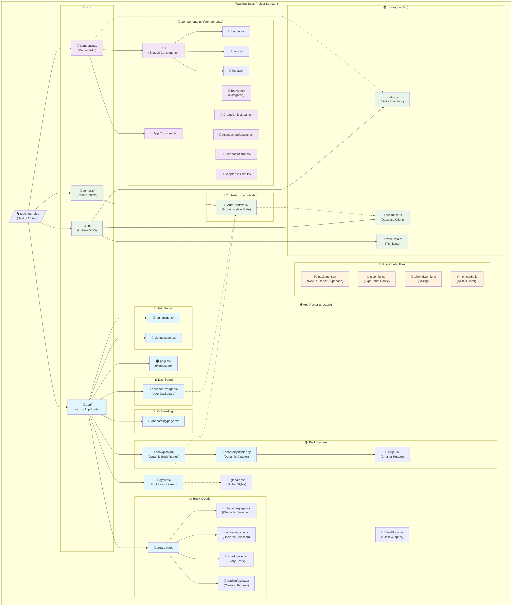

# Teaching Tales - Codebase Structure Map

## 📖 Project Overview

**Teaching Tales** is a Next.js 15 educational platform that creates personalized AI-driven stories for children using characters from popular franchises like Harry Potter, Pokémon, and Marvel.

### 🏗️ Architecture Overview

- **Framework**: Next.js 15 with App Router
- **Language**: TypeScript
- **Auth & Database**: Supabase
- **Styling**: Tailwind CSS + Shadcn/ui components
- **Package Manager**: Bun
- **Development**: ESLint, Biome for formatting

## 🗺️ Visual Project Structure



## 📁 Detailed Directory Structure

### 🏠 Root Level
```
teaching-tales/
├── 📦 package.json          # Dependencies & scripts
├── ⚙️ tsconfig.json         # TypeScript configuration
├── 🎨 tailwind.config.ts    # Tailwind CSS configuration
├── ⚡ next.config.js        # Next.js configuration
├── 📋 biome.json            # Code formatting rules
├── 🔧 eslint.config.mjs     # ESLint configuration
└── 📂 src/                  # Source code directory
```

### 📂 src/app/ - Next.js App Router

#### Core Pages
- **`layout.tsx`** - Root layout with fonts, global CSS, and AuthProvider
- **`page.tsx`** - Marketing homepage with cosmic theme
- **`globals.css`** - Global styles and CSS custom properties
- **`ClientBody.tsx`** - Client-side body wrapper component

#### Authentication Flow
```
📁 auth/
├── 📄 login/page.tsx        # User login page
└── 📄 signup/page.tsx       # User registration page
```

#### User Dashboard
```
📁 dashboard/
└── 📄 page.tsx              # Main user dashboard with child profiles
```

#### Onboarding
```
📁 onboarding/
└── 📄 page.tsx              # New user onboarding flow
```

#### Dynamic Book System
```
📁 book/
└── 📁 [bookId]/
    └── 📁 chapter/
        └── 📁 [chapterId]/
            └── 📄 page.tsx  # Individual chapter reading interface
```

#### Book Creation Flow
```
📁 create-book/
├── 📄 character/page.tsx    # Character selection step
├── 📄 universe/page.tsx     # Universe/world selection step  
├── 📄 spark/page.tsx        # Story spark/prompt creation
└── 📄 loading/page.tsx      # Story generation loading screen
```

### 📂 src/components/ - Reusable Components

#### UI Foundation (Shadcn/ui)
```
📁 ui/
├── 📄 button.tsx            # Button component variants
├── 📄 card.tsx              # Card component for content containers
├── 📄 input.tsx             # Form input components
└── 📄 label.tsx             # Form label components
```

#### Application Components
```
📄 TopNav.tsx                # Main navigation component
📄 TopNavWithTabs.tsx        # Navigation with tab variants
📄 CreateChildModal.tsx      # Modal for creating child profiles
📄 AssessmentResults.tsx     # Post-chapter assessment display
📄 ChapterChoices.tsx        # Story choice selection interface
📄 GuidingQuestions.tsx      # Reading comprehension questions
📄 FeedbackButton.tsx        # User feedback collection
📄 RewardsModal.tsx          # Achievement/rewards display
📄 StreakModal.tsx           # Reading streak celebrations
```

### 📂 src/contexts/ - State Management
```
📄 AuthContext.tsx           # Authentication state management
                            # - User session handling
                            # - Profile management
                            # - Sign out functionality
```

### 📂 src/lib/ - Utilities & Database
```
📄 supabase.ts              # Supabase client setup
                            # - Database types (Profile, Child, Book, etc.)
                            # - Auth helpers
                            # - Database operations

📄 utils.ts                 # Utility functions
                            # - cn() for className merging

📄 mockData.ts              # Development/testing data
                            # - Sample characters, universes, stories
```

## 🔄 Key User Flows

### 1. New User Journey
```
Landing Page → Sign Up → Onboarding → Dashboard → Create Child Profile → Book Creation
```

### 2. Book Creation Flow  
```
Character Selection → Universe Selection → Story Spark → Loading/Generation → Reading Experience
```

### 3. Reading Experience
```
Book Dashboard → Chapter Selection → Reading Interface → Assessment → Next Chapter/Rewards
```

### 4. Authenticated User Flow
```
Login → Dashboard → [Select Child] → [Continue Reading | Create New Book]
```

## 🎯 Core Features

### ✨ Educational Features
- **Adaptive Reading Levels** - Stories adjust to child's Lexile level
- **Comprehension Assessment** - Questions after each chapter
- **Progress Tracking** - Reading streaks and achievements  
- **Reward System** - Coins for correct answers, redeemable for Robux

### 🎨 User Experience
- **Cosmic/Magical Theme** - Deep space backgrounds with gradients
- **Character Integration** - Harry Potter, Pokémon, Marvel characters
- **Choose-Your-Adventure** - Interactive story branching
- **Responsive Design** - Mobile, tablet, desktop optimized

### 🔧 Technical Architecture
- **Server-Side Rendering** - Next.js App Router with SSR
- **Real-time Auth** - Supabase authentication with session management
- **Type Safety** - Full TypeScript implementation
- **Component Library** - Shadcn/ui for consistent design system

## 🚀 Development Commands

```bash
# Development server
bun dev

# Production build  
bun run build

# Code linting & type checking
bun run lint

# Code formatting
bun run format
```

## 📋 Key Dependencies

### Core Framework
- **Next.js 15** - React framework with App Router
- **React 18** - UI library
- **TypeScript** - Type safety

### Database & Auth
- **Supabase** - Authentication and database
- **@supabase/supabase-js** - Supabase client

### UI & Styling  
- **Tailwind CSS** - Utility-first CSS framework
- **Shadcn/ui** - Component library (@radix-ui/react-slot, class-variance-authority)
- **Lucide React** - Icon library
- **clsx & tailwind-merge** - Conditional class utilities

### Development Tools
- **Biome** - Code formatting
- **ESLint** - Code linting  
- **Playwright** - E2E testing
- **Puppeteer** - Browser automation

---

*This map provides a comprehensive overview of the Teaching Tales codebase structure. Use it as a reference when navigating the project or planning new features.*
