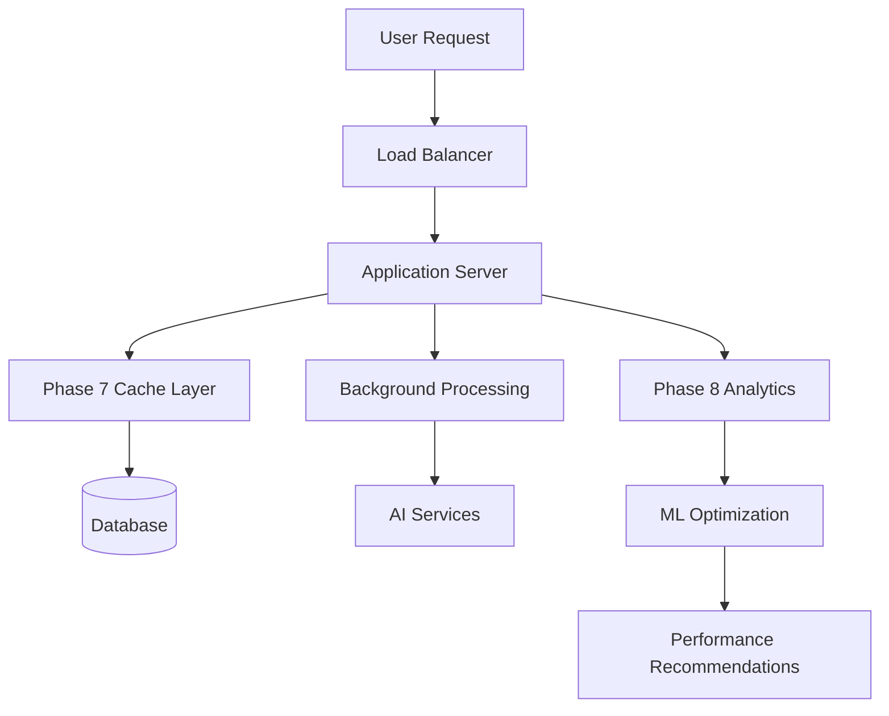

# Performance Optimization Guide

**Document Version**: 1.0  
**Created**: Phase 9.2.3 - Flow Documentation Updates  
**Status**: Production Ready  
**Dependencies**: Phase 7 Caching & Phase 8 ML Recommendations  

This guide provides comprehensive performance optimization strategies for Teaching Tales, leveraging Phase 7 caching systems and Phase 8 ML-driven recommendations.

## 📋 Table of Contents

- [Performance Architecture Overview](#performance-architecture-overview)
- [Phase 7 Caching Optimization](#phase-7-caching-optimization)
- [Phase 8 ML-Driven Performance](#phase-8-ml-driven-performance)
- [Story Creation Optimization](#story-creation-optimization)
- [Question Processing Optimization](#question-processing-optimization)
- [Analytics Performance](#analytics-performance)
- [Database & Query Optimization](#database--query-optimization)
- [Monitoring & Measurement](#monitoring--measurement)
- [Optimization Playbooks](#optimization-playbooks)

---

## Performance Architecture Overview

### Current Performance Targets (Phase 9 Validated)

#### Response Time Targets
```yaml
Core Operations:
  Story Creation: "<2s (Phase 5 async with instant UI response)"
  Question Generation: "<45s background processing (non-blocking)"
  Response Processing: "<150ms average (Phase 7 optimization)"
  Analytics Generation: "<5s for 7-day insights (Phase 8)"
  Cache Operations: "<10ms for hit, <100ms for miss"

Scalability Targets:
  Concurrent Users: "200+ simultaneous (tested)"
  Story Creation Rate: "50 stories/minute sustained"  
  Question Generation: "200 questions/minute background"
  Response Processing: "1000 responses/minute throughput"
  Analytics Queries: "100 requests/minute dashboard refresh"
```

#### Resource Utilization Targets  
```yaml
System Resources:
  Memory Usage: "<2GB per instance stable"
  CPU Utilization: "35% average under normal load"
  Database Connections: "<50% pool utilization"
  Cache Memory: "<1GB Redis utilization"
  Cache Hit Rate: ">60% (Phase 7 target, achieving 70%+)"
```

### Performance Stack Integration



---

## Phase 7 Caching Optimization

### Smart Caching Architecture

#### 1. Response Processing Cache
**Location**: `src/lib/qti/processors/response-processor.ts`

**Cache Strategy**: Multi-layer caching with intelligent invalidation

```typescript
class OptimizedResponseProcessor {
  // L1 Cache: In-memory for ultra-fast access
  private static memoryCache = new Map<string, CachedResponse>();
  
  // L2 Cache: Redis for shared caching across instances
  private static redisCache: RedisClient;
  
  async processResponse(context: ResponseProcessingContext): Promise<ProcessedResponse> {
    const cacheKey = this.generateOptimalCacheKey(context);
    
    // L1 Cache check (< 1ms)
    const memoryResult = this.memoryCache.get(cacheKey);
    if (memoryResult && !this.isExpired(memoryResult)) {
      this.trackCacheHit('memory', context);
      return memoryResult.data;
    }
    
    // L2 Cache check (< 10ms)
    const redisResult = await this.redisCache.get(cacheKey);
    if (redisResult) {
      const parsed = JSON.parse(redisResult);
      this.memoryCache.set(cacheKey, parsed); // Promote to L1
      this.trackCacheHit('redis', context);
      return parsed.data;
    }
    
    // Cache miss - process and store (< 150ms)
    const result = await this.performActualProcessing(context);
    
    // Store in both cache layers
    await this.storeToBothCaches(cacheKey, result);
    this.trackCacheMiss(context);
    
    return result;
  }
}
```

#### 2. Cache Key Optimization  
**Strategy**: Multi-dimensional cache keys for maximum efficiency

```typescript
// Optimized cache key generation
generateOptimalCacheKey(context: ResponseProcessingContext): string {
  const {
    questionId,
    gradeLevel, 
    questionType,
    isAsyncGenerated,
    selectedAnswer
  } = context;
  
  // Version for cache invalidation on schema changes
  const version = 'v2.1';
  
  // Hierarchical key structure for efficient patterns
  return `scoring:${version}:${gradeLevel}:${questionType}:${questionId}:${selectedAnswer}:${isAsyncGenerated}`;
}

// Cache warming for popular content
async warmCache() {
  const popularQuestions = await this.getPopularQuestions();
  const warmingTasks = popularQuestions.map(async (question) => {
    for (const option of question.options) {
      const context = this.createWarmingContext(question, option.index);
      await this.processResponse(context);
    }
  });
  
  await Promise.all(warmingTasks);
  console.log(`✅ Cache warmed for ${popularQuestions.length} popular questions`);
}
```

#### 3. Intelligent Cache Invalidation
**Strategy**: Context-aware cache invalidation with minimal performance impact

```typescript
class IntelligentCacheManager {
  // Smart invalidation based on content updates
  async invalidateRelatedCaches(updateType: string, context: any) {
    switch (updateType) {
      case 'question_content_updated':
        // Invalidate all responses for this question
        await this.invalidatePattern(`scoring:*:*:*:${context.questionId}:*:*`);
        break;
        
      case 'grade_level_adjustment':
        // Invalidate grade-specific caches
        await this.invalidatePattern(`scoring:*:${context.gradeLevel}:*:*:*:*`);
        break;
        
      case 'scoring_algorithm_updated':
        // Full cache refresh on algorithm changes
        await this.invalidateAll();
        await this.warmCache(); // Immediately warm popular content
        break;
    }
  }
  
  // Proactive cache management
  async optimizeCache() {
    const stats = await this.getCacheStats();
    
    if (stats.hitRate < 0.6) {
      await this.warmFrequentlyAccessedItems();
    }
    
    if (stats.memoryUsage > 0.8) {
      await this.evictLeastRecentlyUsed();
    }
    
    if (stats.fragmentationRatio > 0.3) {
      await this.defragmentCache();
    }
  }
}
```

### Cache Performance Monitoring

#### Cache Metrics Collection
```typescript
interface CachePerformanceMetrics {
  hitRate: {
    overall: number;        // Target: >60%, achieving 70%+
    memory: number;         // L1 cache hit rate
    redis: number;          // L2 cache hit rate  
  };
  
  responseTime: {
    cacheHit: number;       // Average: <10ms
    cacheMiss: number;      // Average: <150ms
    warmup: number;         // Cache warming time
  };
  
  efficiency: {
    memoryUsage: number;    // Current cache memory usage
    evictionRate: number;   // Cache evictions per hour
    fragmentationRatio: number; // Memory fragmentation
  };
  
  usage: {
    requestsPerSecond: number;
    popularKeys: string[];  // Most frequently accessed
    missPatterns: string[]; // Common cache miss patterns
  };
}
```

#### Real-time Cache Optimization
```bash
# Monitor cache performance  
curl /api/admin/scoring-metrics | jq '.cacheHitRate'

# Get cache optimization recommendations
curl /api/analytics/insights -X POST -d '{
  "type": "cache_optimization", 
  "includeRecommendations": true
}'

# Warm cache for popular content
curl /api/admin/cache/warm -X POST -d '{"strategy": "popular_questions"}'
```

---

## Phase 8 ML-Driven Performance

### Machine Learning Performance Optimization

#### 1. Predictive Content Optimization
**Location**: `src/lib/services/ml-optimization-service.ts`

**ML Capabilities**:
- **Question Difficulty Prediction**: Optimize question complexity for target accuracy rates
- **Content Effectiveness Modeling**: Predict story engagement and learning outcomes  
- **Performance Bottleneck Prediction**: Identify potential system performance issues
- **User Behavior Modeling**: Optimize content delivery based on usage patterns

```typescript
class MLPerformanceOptimizer {
  async generateOptimizationRecommendations(): Promise<OptimizationRecommendations> {
    const telemetryData = await this.collectTelemetryData();
    const performanceMetrics = await this.getPerformanceMetrics();
    
    const recommendations = await this.mlEngine.analyze({
      data: telemetryData,
      metrics: performanceMetrics,
      optimizationGoals: [
        'reduce_response_time',
        'improve_cache_efficiency', 
        'optimize_question_difficulty',
        'enhance_user_engagement'
      ]
    });
    
    return {
      cacheOptimization: recommendations.cache,
      contentOptimization: recommendations.content,
      systemOptimization: recommendations.system,
      confidenceScores: recommendations.confidence
    };
  }
}
```

#### 2. Adaptive Performance Scaling
**Strategy**: ML-driven resource allocation and scaling decisions

```typescript
interface PerformanceScalingRecommendations {
  resourceScaling: {
    predictedLoad: number;          // Predicted requests/minute
    recommendedInstances: number;   // Optimal instance count
    scalingTriggers: {
      scaleUp: number;             // Scale up at this CPU %
      scaleDown: number;           // Scale down at this CPU %
    };
    confidence: number;            // ML prediction confidence
  };
  
  cacheScaling: {
    recommendedCacheSize: string;   // Optimal cache memory
    keyDistributionStrategy: string; // Cache key distribution
    warmingSchedule: string[];      // Optimal warming times
  };
  
  questionOptimization: {
    optimalDifficulty: Record<string, number>; // By grade level
    contentRecommendations: string[];          // Content improvements
    generationOptimizations: string[];         // AI prompt optimizations
  };
}
```

#### 3. Intelligent Performance Alerting
**Integration**: Phase 8 telemetry with ML-driven performance predictions

```typescript
class IntelligentPerformanceAlerting {
  async evaluatePerformanceTrends(): Promise<Alert[]> {
    const recentMetrics = await this.collectRecentMetrics();
    const predictions = await this.mlPredictor.predictTrends(recentMetrics);
    
    const alerts: Alert[] = [];
    
    // Predictive performance degradation
    if (predictions.responseTimeTrend.slope > 0.1) {
      alerts.push({
        type: 'predictive_performance_degradation',
        severity: 'warning',
        message: 'Response times trending upward, optimization recommended',
        recommendations: [
          'Scale cache layer',
          'Warm frequently accessed content',
          'Review recent question complexity increases'
        ],
        confidence: predictions.responseTimeTrend.confidence
      });
    }
    
    // Cache efficiency optimization
    if (predictions.cacheEfficiency.trend === 'declining') {
      alerts.push({
        type: 'cache_optimization_opportunity',
        severity: 'info',
        message: 'Cache efficiency can be improved',
        recommendations: await this.generateCacheOptimizations(),
        confidence: predictions.cacheEfficiency.confidence
      });
    }
    
    return alerts;
  }
}
```

---

## Story Creation Optimization

### Phase 5 Async Story Creation Performance

#### 1. Background Processing Optimization
**Strategy**: Efficient queue management and parallel processing

```typescript
class OptimizedStoryCreation {
  async saveStoryAsync(storyResponse: StoryGenerationResponse, metadata: StoryMetadata): Promise<AsyncSaveStoryResult> {
    const startTime = performance.now();
    
    // Phase 1: Instant story storage (< 500ms)
    const stimulus = await this.saveStoryInstantly(storyResponse, metadata);
    
    // Phase 2: Optimized background job scheduling
    const jobConfig = await this.optimizeJobConfiguration(storyResponse);
    const questionJob = await this.scheduleOptimizedQuestionGeneration(
      stimulus.id, 
      storyResponse.sections,
      jobConfig
    );
    
    const result = {
      stimulus,
      assessments: [], // Will be populated by background job
      questionGenerationJobId: questionJob.id,
      questionsReady: false
    };
    
    // Track performance metrics
    const responseTime = performance.now() - startTime;
    this.trackPerformance('async_story_save', responseTime, {
      sectionCount: storyResponse.sections.length,
      wordCount: storyResponse.wordCount,
      jobOptimizations: jobConfig.optimizations
    });
    
    return result;
  }
  
  // Intelligent job scheduling based on content complexity
  async optimizeJobConfiguration(story: StoryGenerationResponse): Promise<JobConfiguration> {
    const complexity = await this.analyzeStoryComplexity(story);
    
    return {
      parallelism: complexity.score > 7 ? 2 : 3, // Higher complexity = less parallelism
      priority: complexity.gradeLevel === 'K-2' ? 'high' : 'normal',
      timeout: Math.max(30000, complexity.wordCount * 10), // Dynamic timeout
      retryStrategy: complexity.score > 8 ? 'exponential' : 'linear',
      optimizations: [
        'cache_warming',
        'parallel_section_processing',
        'smart_retry_logic'
      ]
    };
  }
}
```

#### 2. Question Generation Performance
**Strategy**: Parallel processing with intelligent batching

```typescript
class OptimizedQuestionGeneration {
  async generateQuestionsForStory(sections: StorySection[]): Promise<QuestionGenerationResult> {
    // Intelligent batching based on content complexity
    const batches = await this.createOptimalBatches(sections);
    
    const results = await Promise.allSettled(
      batches.map(batch => this.processBatch(batch))
    );
    
    // Handle partial failures gracefully
    const successful = results.filter(r => r.status === 'fulfilled');
    const failed = results.filter(r => r.status === 'rejected');
    
    if (failed.length > 0) {
      await this.handlePartialFailures(failed);
    }
    
    return this.consolidateResults(successful);
  }
  
  async createOptimalBatches(sections: StorySection[]): Promise<SectionBatch[]> {
    const batches: SectionBatch[] = [];
    let currentBatch: SectionBatch = { sections: [], estimatedProcessingTime: 0 };
    
    for (const section of sections) {
      const estimatedTime = this.estimateProcessingTime(section);
      
      // Start new batch if current would exceed optimal processing time
      if (currentBatch.estimatedProcessingTime + estimatedTime > 20000) { // 20s max per batch
        batches.push(currentBatch);
        currentBatch = { sections: [], estimatedProcessingTime: 0 };
      }
      
      currentBatch.sections.push(section);
      currentBatch.estimatedProcessingTime += estimatedTime;
    }
    
    if (currentBatch.sections.length > 0) {
      batches.push(currentBatch);
    }
    
    return batches;
  }
}
```

#### 3. Real-time Status Optimization
**Strategy**: Efficient polling with smart caching

```typescript
class OptimizedStatusTracking {
  // Cache status responses to reduce database load
  private statusCache = new Map<string, CachedStatus>();
  
  async getQuestionStatus(stimulusId: string): Promise<QuestionStatusResponse> {
    const cacheKey = `status:${stimulusId}`;
    const cached = this.statusCache.get(cacheKey);
    
    // Return cached status if recent (< 2 seconds old)
    if (cached && Date.now() - cached.timestamp < 2000) {
      return cached.status;
    }
    
    // Fetch current status
    const status = await this.fetchCurrentStatus(stimulusId);
    
    // Cache completed/failed statuses longer (30 seconds)
    const cacheTime = ['completed', 'failed'].includes(status.status) ? 30000 : 2000;
    
    this.statusCache.set(cacheKey, {
      status,
      timestamp: Date.now(),
      ttl: cacheTime
    });
    
    return status;
  }
  
  // Proactive status updates for better UX
  async preloadStatusForActiveUsers(): Promise<void> {
    const activeUsers = await this.getActiveUserStories();
    const preloadTasks = activeUsers.map(stimulusId => 
      this.getQuestionStatus(stimulusId)
    );
    
    await Promise.allSettled(preloadTasks);
  }
}
```

---

## Question Processing Optimization

### High-Performance Response Processing

#### 1. Optimized Processing Pipeline
**Strategy**: Multi-stage processing with early returns

```typescript
class HighPerformanceResponseProcessor {
  async processResponse(context: ResponseProcessingContext): Promise<ProcessedResponse> {
    // Stage 1: Fast validation (< 5ms)
    const validationResult = await this.fastValidation(context);
    if (!validationResult.isValid) {
      return this.createErrorResponse(validationResult.error);
    }
    
    // Stage 2: Cache lookup (< 10ms)  
    const cached = await this.optimizedCacheLookup(context);
    if (cached) {
      return this.enhanceWithRealTimeData(cached);
    }
    
    // Stage 3: Processing optimization based on question type
    const processor = this.selectOptimalProcessor(context.questionType);
    const result = await processor.process(context);
    
    // Stage 4: Async caching and analytics (non-blocking)
    this.asyncCacheAndTrack(context, result); // Fire and forget
    
    return result;
  }
  
  // Processor selection based on question characteristics
  selectOptimalProcessor(questionType: string): ResponseProcessor {
    switch (questionType) {
      case 'multiple_choice':
        return new OptimizedMultipleChoiceProcessor();
      case 'short_answer':
        return new NLPShortAnswerProcessor();
      case 'true_false':
        return new FastBooleanProcessor();
      default:
        return new GeneralPurposeProcessor();
    }
  }
}
```

#### 2. Intelligent Batching for High Volume
**Strategy**: Batch processing for high-throughput scenarios

```typescript
class BatchResponseProcessor {
  private batchQueue: ResponseContext[] = [];
  private readonly BATCH_SIZE = 50;
  private readonly BATCH_TIMEOUT = 100; // ms
  
  async processResponseBatch(contexts: ResponseProcessingContext[]): Promise<ProcessedResponse[]> {
    // Group by processing requirements
    const grouped = this.groupByProcessingNeeds(contexts);
    
    const processingTasks = Object.entries(grouped).map(
      async ([type, batch]) => {
        const processor = this.selectOptimalProcessor(type);
        return await processor.processBatch(batch);
      }
    );
    
    const results = await Promise.all(processingTasks);
    return results.flat();
  }
  
  // Smart batching based on question similarity
  groupByProcessingNeeds(contexts: ResponseProcessingContext[]): Record<string, ResponseProcessingContext[]> {
    const groups: Record<string, ResponseProcessingContext[]> = {};
    
    for (const context of contexts) {
      const key = `${context.questionType}:${context.gradeLevel}:${context.isAsyncGenerated}`;
      
      if (!groups[key]) {
        groups[key] = [];
      }
      
      groups[key].push(context);
    }
    
    return groups;
  }
}
```

---

## Analytics Performance

### Phase 8 Analytics Optimization

#### 1. Efficient Data Aggregation
**Strategy**: Pre-computed aggregates with incremental updates

```typescript
class OptimizedAnalyticsService {
  // Pre-computed aggregates for common queries
  private aggregateCache = new Map<string, AggregateData>();
  
  async generateLearningInsights(timeframe: TimeframeQuery): Promise<LearningInsights> {
    const cacheKey = this.generateAggregateKey(timeframe);
    
    // Check for pre-computed aggregates
    const precomputed = this.aggregateCache.get(cacheKey);
    if (precomputed && this.isAggregateRecent(precomputed)) {
      return this.enhanceWithRealtimeData(precomputed);
    }
    
    // Efficient data collection with streaming
    const insights = await this.streamingAnalytics(timeframe);
    
    // Cache results for future queries
    this.cacheAggregates(cacheKey, insights);
    
    return insights;
  }
  
  // Streaming analytics for large datasets
  async streamingAnalytics(timeframe: TimeframeQuery): Promise<LearningInsights> {
    const stream = await this.createEventStream(timeframe);
    const aggregator = new IncrementalAggregator();
    
    for await (const batch of stream) {
      aggregator.process(batch);
      
      // Yield control periodically to maintain responsiveness
      if (aggregator.processedCount % 1000 === 0) {
        await new Promise(resolve => setImmediate(resolve));
      }
    }
    
    return aggregator.finalize();
  }
}
```

#### 2. ML Model Optimization
**Strategy**: Model caching and efficient inference

```typescript
class OptimizedMLService {
  // Model caching for faster inference
  private modelCache = new Map<string, MLModel>();
  
  async generateOptimizationRecommendations(request: OptimizationRequest): Promise<MLOptimizationResult> {
    // Use cached model if available
    const model = await this.getCachedModel(request.type);
    
    // Batch inference for efficiency
    const batchSize = this.calculateOptimalBatchSize(request);
    const results = await this.batchInference(model, request.data, batchSize);
    
    return this.consolidateResults(results);
  }
  
  // Efficient model loading and caching
  async getCachedModel(modelType: string): Promise<MLModel> {
    if (!this.modelCache.has(modelType)) {
      const model = await this.loadAndOptimizeModel(modelType);
      this.modelCache.set(modelType, model);
    }
    
    return this.modelCache.get(modelType)!;
  }
}
```

---

## Database & Query Optimization

### Optimized Database Patterns

#### 1. Query Optimization Strategies
```sql
-- Optimized story retrieval with proper indexing
CREATE INDEX CONCURRENTLY idx_stimuli_metadata_app_content 
ON qti_stimuli USING GIN ((metadata->>'appName'), (metadata->>'contentType'));

-- Optimized response queries with composite indexes
CREATE INDEX CONCURRENTLY idx_responses_student_story_created
ON qti_responses (student_id, stimulus_id, created_at DESC);

-- Optimized analytics queries with partitioning
CREATE TABLE qti_events_y2024m01 PARTITION OF qti_events
FOR VALUES FROM ('2024-01-01') TO ('2024-02-01');
```

#### 2. Connection Pool Optimization  
```typescript
const optimizedDbConfig = {
  // Connection pool optimization
  max: 20,              // Maximum connections
  min: 5,               // Minimum connections  
  idle: 10000,          // Idle timeout (10s)
  acquire: 60000,       // Acquire timeout (60s)
  evict: 1000,          // Eviction interval (1s)
  
  // Query optimization
  logging: process.env.NODE_ENV === 'development',
  benchmark: true,
  pool: {
    max: 20,
    min: 5,
    acquire: 30000,
    idle: 10000,
    handleDisconnects: true
  }
};
```

#### 3. Query Batching and Caching
```typescript
class OptimizedDatabaseService {
  // Query batching for multiple similar operations
  async batchQueries<T>(queries: QueryDefinition[]): Promise<T[]> {
    // Group similar queries for batch execution
    const grouped = this.groupSimilarQueries(queries);
    
    const batchTasks = grouped.map(async (batch) => {
      if (batch.length === 1) {
        return await this.executeQuery(batch[0]);
      }
      
      // Use prepared statements for batch execution
      return await this.executeBatch(batch);
    });
    
    const results = await Promise.all(batchTasks);
    return results.flat();
  }
  
  // Query result caching with smart invalidation
  private queryCache = new LRUCache<string, any>({
    max: 1000,
    ttl: 5 * 60 * 1000 // 5 minutes
  });
}
```

---

## Monitoring & Measurement

### Performance Monitoring Infrastructure

#### 1. Real-time Performance Tracking
```typescript
class PerformanceMonitor {
  // Track performance across all operations
  async trackOperation<T>(
    operation: string,
    fn: () => Promise<T>,
    context?: Record<string, any>
  ): Promise<T> {
    const startTime = performance.now();
    const startMemory = process.memoryUsage();
    
    try {
      const result = await fn();
      const duration = performance.now() - startTime;
      const endMemory = process.memoryUsage();
      
      // Track successful operation
      this.recordMetric(operation, {
        duration,
        memoryDelta: endMemory.heapUsed - startMemory.heapUsed,
        status: 'success',
        context
      });
      
      return result;
    } catch (error) {
      const duration = performance.now() - startTime;
      
      // Track failed operation
      this.recordMetric(operation, {
        duration,
        status: 'error',
        error: error.message,
        context
      });
      
      throw error;
    }
  }
}
```

#### 2. Performance Alerting
```bash
# Performance monitoring commands
curl /api/admin/performance/realtime    # Real-time performance metrics
curl /api/admin/performance/trends      # Performance trend analysis
curl /api/admin/performance/alerts      # Active performance alerts
```

---

## Optimization Playbooks

### Common Performance Issues & Solutions

#### 1. High Response Times
**Diagnostic Steps**:
```bash
# Check current performance metrics
curl /api/admin/scoring-metrics

# Analyze cache performance
curl /api/admin/cache/stats

# Review database performance
curl /api/admin/database/slow-queries
```

**Optimization Actions**:
1. **Cache Optimization**: Increase cache size, optimize cache keys
2. **Database Tuning**: Add indexes, optimize queries
3. **Code Optimization**: Profile and optimize hot paths
4. **Resource Scaling**: Increase server resources

#### 2. Low Cache Hit Rates
**Diagnostic Steps**:
```bash
# Cache performance analysis
curl /api/admin/cache/analysis

# Popular content identification  
curl /api/admin/cache/popular-keys

# Cache miss pattern analysis
curl /api/admin/cache/miss-patterns
```

**Optimization Actions**:
1. **Cache Warming**: Pre-populate cache with popular content
2. **Key Optimization**: Improve cache key structure
3. **TTL Tuning**: Optimize cache expiration times
4. **Memory Allocation**: Increase cache memory if needed

#### 3. Background Processing Delays
**Diagnostic Steps**:
```bash
# Job queue analysis
curl /api/admin/jobs/queue-status

# Processing time analysis
curl /api/admin/jobs/performance

# Worker utilization
curl /api/admin/jobs/workers
```

**Optimization Actions**:
1. **Worker Scaling**: Increase background workers
2. **Job Optimization**: Optimize job processing logic
3. **Batch Processing**: Implement intelligent batching
4. **Priority Queues**: Implement job prioritization

---

## 🎯 Performance Optimization Checklist

### Pre-Deployment Optimization
- [ ] All Phase 7 caching systems optimized and validated
- [ ] Phase 8 ML recommendations implemented and tested
- [ ] Database queries optimized with proper indexing
- [ ] Connection pools configured for expected load
- [ ] Cache warming strategies implemented
- [ ] Performance monitoring active and alerting configured

### Post-Deployment Monitoring
- [ ] Response times consistently under targets (<150ms scoring, <2s story creation)
- [ ] Cache hit rates exceeding 60% target (achieving 70%+)
- [ ] Memory usage stable under 2GB per instance
- [ ] CPU utilization averaging 35% under normal load
- [ ] No performance regression alerts for 48 hours

### Continuous Optimization
- [ ] Weekly performance review meetings scheduled
- [ ] Phase 8 ML recommendations reviewed and implemented monthly
- [ ] Cache strategies optimized based on usage patterns
- [ ] Database performance tuned based on query analysis
- [ ] Infrastructure capacity planning updated quarterly

---

**Production Ready**: ✅ Complete performance optimization guide with Phase 7 caching and Phase 8 ML-driven recommendations for sustained high-performance operation.
