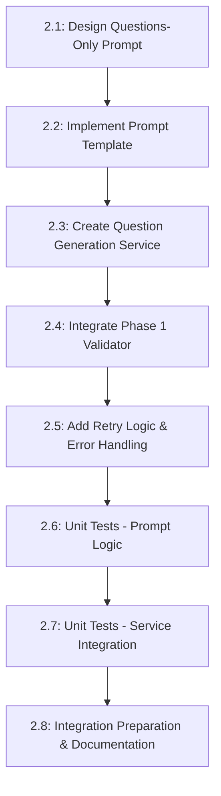

# Phase 2 Detailed Roadmap: Questions-Only Prompt and Generation Service

**Objective**: Implement AI-powered question generation for individual story sections, following existing codebase patterns and integrating with Phase 1 validation foundation.

**Estimated Time**: 2-3 days
**Dependencies**: Phase 1 types and validation (✅ Complete)
**Deliverables**: Question generation service ready for Phase 3 API integration

---

## Task Overview & Dependencies



---

## 2.1 Design Questions-Only Prompt Template (30 minutes)

**Goal**: Create a focused prompt that generates high-quality questions for a single story section.

### 📋 Tasks:
- [ ] **Analyze existing prompt patterns** in `src/lib/ai/prompt-templates.ts`
- [ ] **Design prompt structure** following existing `generateStoryPrompt` format:
  - Clear parameter sections
  - Detailed requirements
  - JSON schema enforcement  
  - Grade-level specific guidance integration
- [ ] **Map input contract** from `SectionQuestionGenInput` (Phase 1) to prompt variables
- [ ] **Define deterministic output schema** ensuring compatibility with `EnhancedComprehensionQuestion`

### 🎯 Success Criteria:
- Prompt template structure matches existing codebase patterns
- Input parameters clearly mapped from `SectionQuestionGenInput`
- Output schema produces `EnhancedComprehensionQuestion[]` compatible with existing UI
- Grade-level guidance integration points identified

---

## 2.2 Implement Prompt Template Method (45 minutes)

**Goal**: Add `generateQuestionsForSection()` method to `PromptTemplates` class.

### 📋 Tasks:
- [ ] **Add method signature** to `src/lib/ai/prompt-templates.ts`:
  ```typescript
  static generateQuestionsForSection(input: SectionQuestionGenInput): string
  ```
- [ ] **Implement prompt assembly** using designed template from 2.1
- [ ] **Integrate grade-level guidance** using existing `getGradeLevelGuidance()` method
- [ ] **Add input validation** using existing `validatePromptInputs()` pattern
- [ ] **Add input sanitization** using existing `sanitizeInput()` method

### 🎯 Success Criteria:
- Method follows existing code patterns and style
- Proper TypeScript types from Phase 1 integration
- Input validation prevents malformed prompts
- Grade-level specific requirements included
- Prompt generates deterministic JSON output schema

### 📄 Implementation Notes:
```typescript
// Expected method signature
static generateQuestionsForSection(input: SectionQuestionGenInput): string {
  // Validate input
  const errors = this.validateQuestionGenInputs(input);
  if (errors.length > 0) {
    throw new Error(`Invalid input: ${errors.join(', ')}`);
  }

  // Get grade-level guidance 
  const gradeGuidance = this.getGradeLevelGuidance(input.gradeLevel);

  // Build and return prompt
  return `Generate comprehension questions for this story section...`;
}
```

---

## 2.3 Create Question Generation Service Foundation (60 minutes)

**Goal**: Create service class with core generation method following existing service patterns.

### 📋 Tasks:
- [ ] **Create service file** `src/lib/ai/question-generation-service.ts`
- [ ] **Analyze existing AI service patterns** in codebase for consistency
- [ ] **Define service class structure**:
  ```typescript
  export class QuestionGenerationService {
    static async generateQuestionsForSection(
      input: SectionQuestionGenInput
    ): Promise<SectionQuestionsResult>
  }
  ```
- [ ] **Implement core generation logic**:
  - Use `PromptTemplates.generateQuestionsForSection()` from 2.2
  - Integrate with existing AI client (likely `GeminiClient`)
  - Parse response using existing `parseAIResponse()` method
  - Transform to `SectionQuestionsResult` format

### 🎯 Success Criteria:
- Service follows existing codebase patterns for AI services
- Proper async/await error handling
- Returns `SectionQuestionsResult` matching Phase 1 contracts
- Integrates with existing AI infrastructure
- Clean separation of concerns (service logic vs prompt logic)

### 📄 Key Integration Points:
```typescript
// Expected service structure
export class QuestionGenerationService {
  static async generateQuestionsForSection(
    input: SectionQuestionGenInput
  ): Promise<SectionQuestionsResult> {
    // 1. Generate prompt using Phase 2.2 method
    const prompt = PromptTemplates.generateQuestionsForSection(input);
    
    // 2. Call AI service (follow existing patterns)
    const aiResponse = await AIClient.generate(prompt);
    
    // 3. Parse response (use existing parser)
    const parsed = PromptTemplates.parseAIResponse(aiResponse);
    
    // 4. Transform to SectionQuestionsResult
    return this.transformToSectionResult(parsed, input);
  }
}
```

---

## 2.4 Integrate Phase 1 Validator (30 minutes)

**Goal**: Add validation step using Phase 1 validator before returning results.

### 📋 Tasks:
- [ ] **Import validator** from `src/lib/qti/validators/section-question-validator.ts`
- [ ] **Add validation step** in `generateQuestionsForSection()` before return:
  ```typescript
  // Validate generated questions
  const validation = SectionQuestionValidator.validateQuestions(
    result.questions,
    input.sectionContent
  );
  if (!validation.isValid) {
    // Handle validation failure (retry once or throw error)
  }
  ```
- [ ] **Handle validation failures** with appropriate error reporting
- [ ] **Add validation metadata** to `SectionQuestionsResult.metadata`

### 🎯 Success Criteria:
- Generated questions pass Phase 1 validation before return
- Validation failures handled gracefully
- Validation results included in response metadata
- No questions returned that would fail existing UI validation

---

## 2.5 Add Retry Logic & Error Handling (45 minutes)

**Goal**: Implement robust retry logic and error handling following existing codebase patterns.

### 📋 Tasks:
- [ ] **Analyze existing retry patterns** in codebase (likely in AI services)
- [ ] **Implement retry logic** for AI generation failures:
  ```typescript
  const maxRetries = 3;
  const baseDelay = 1000;
  
  for (let attempt = 1; attempt <= maxRetries; attempt++) {
    try {
      // Generation attempt
      const result = await this.attemptGeneration(input);
      
      // Validation attempt  
      const validation = this.validateResult(result);
      if (validation.isValid) {
        return result; // Success!
      }
      
      // Validation failed, retry if attempts remain
      if (attempt < maxRetries) {
        await this.delay(baseDelay * attempt);
        continue;
      }
      
      throw new Error(`Validation failed after ${maxRetries} attempts`);
    } catch (error) {
      // Handle different error types
    }
  }
  ```
- [ ] **Add exponential backoff** for rate limiting
- [ ] **Handle different error types**:
  - AI service errors (network, rate limiting, model errors)
  - Validation errors (malformed questions, failed validation)
  - Parse errors (malformed JSON response)
- [ ] **Add comprehensive logging** for debugging and monitoring
- [ ] **Return meaningful error messages** for different failure scenarios

### 🎯 Success Criteria:
- Transient failures handled with appropriate retry logic
- Different error types handled appropriately
- Logging provides debugging information for failures
- Error messages are actionable for developers
- Performance metrics tracked (attempts, timing, success rates)

---

## 2.6 Unit Tests - Prompt Logic (60 minutes)

**Goal**: Comprehensive test coverage for prompt generation and template logic.

### 📋 Tasks:
- [ ] **Create test file** `src/lib/ai/__tests__/prompt-templates-questions.test.ts`
- [ ] **Test prompt template method**:
  ```typescript
  describe('PromptTemplates.generateQuestionsForSection', () => {
    it('generates valid prompt for basic input');
    it('includes grade-level specific guidance');
    it('handles different constraint options');
    it('validates input parameters');
    it('sanitizes potentially dangerous input');
    it('includes story metadata when provided');
  });
  ```
- [ ] **Test input validation**:
  - Required field validation
  - Field length limits
  - Malformed input handling
- [ ] **Test prompt content**:
  - JSON schema enforcement
  - Grade-level guidance inclusion
  - Section content integration
  - Constraint parameter handling
- [ ] **Test edge cases**:
  - Empty section content
  - Very long section content
  - Special characters in content
  - Missing optional parameters

### 🎯 Success Criteria:
- 100% code coverage for prompt template method
- All input validation scenarios tested
- Edge cases properly handled
- Prompt content quality validated
- Tests run fast and are deterministic

---

## 2.7 Unit Tests - Service Integration (90 minutes)

**Goal**: Test service logic, AI integration, validation, and error handling.

### 📋 Tasks:
- [ ] **Create test file** `src/lib/ai/__tests__/question-generation-service.test.ts`
- [ ] **Mock AI client responses** for consistent testing:
  ```typescript
  jest.mock('@/lib/ai/gemini-client', () => ({
    GeminiClient: {
      generate: jest.fn()
    }
  }));
  ```
- [ ] **Test successful generation flow**:
  ```typescript
  describe('QuestionGenerationService.generateQuestionsForSection', () => {
    it('generates questions successfully with valid AI response');
    it('includes correct metadata in result');
    it('validates questions using Phase 1 validator');
    it('transforms AI response to SectionQuestionsResult format');
  });
  ```
- [ ] **Test validation integration**:
  - Questions pass validation
  - Validation failures trigger retry
  - Final validation failure throws error
- [ ] **Test retry logic**:
  - Transient AI errors trigger retry
  - Exponential backoff timing
  - Maximum retry limit respected
  - Different error types handled appropriately
- [ ] **Test error scenarios**:
  - AI service unavailable
  - Malformed AI responses
  - JSON parsing failures
  - Validation failures
  - Network timeouts
- [ ] **Performance tests**:
  - Response time within acceptable limits
  - Memory usage reasonable
  - Concurrent request handling

### 🎯 Success Criteria:
- Service logic thoroughly tested with mocked dependencies
- All error scenarios properly handled
- Retry logic works correctly
- Performance requirements met
- Integration with Phase 1 validator verified

---

## 2.8 Integration Preparation & Documentation (45 minutes)

**Goal**: Prepare service for Phase 3 API integration and document usage.

### 📋 Tasks:
- [ ] **Add JSDoc documentation** to service methods:
  ```typescript
  /**
   * Generate comprehension questions for a specific story section
   * 
   * @param input - Section content and generation parameters
   * @returns Promise resolving to section questions with metadata
   * @throws {ValidationError} When generated questions fail validation
   * @throws {AIServiceError} When AI generation fails after retries
   * 
   * @example
   * const result = await QuestionGenerationService.generateQuestionsForSection({
   *   sectionContent: "Once upon a time...",
   *   sectionIndex: 0,
   *   gradeLevel: "4-5"
   * });
   */
  ```
- [ ] **Add logging hooks** for monitoring:
  - Generation start/completion
  - Retry attempts
  - Validation results  
  - Performance metrics
- [ ] **Export service from index** for clean imports
- [ ] **Create usage examples** in documentation
- [ ] **Verify TypeScript types** are properly exported
- [ ] **Run integration smoke test** with real AI service (if available)

### 🎯 Success Criteria:
- Service API is well-documented
- Logging provides monitoring insights
- Clean import/export structure
- Ready for Phase 3 API endpoint integration
- TypeScript types properly exported

---

## Quality Gates & Acceptance Criteria

### 🔍 **Before Moving to Phase 3:**
- [ ] All unit tests pass with >90% coverage
- [ ] Service generates valid questions that pass Phase 1 validation
- [ ] Retry logic handles transient failures appropriately
- [ ] Error messages are actionable and well-categorized
- [ ] Performance meets requirements (< 30s generation time)
- [ ] Code follows existing codebase patterns and style
- [ ] Documentation is complete and accurate
- [ ] TypeScript types are properly defined and exported

### 🎯 **Integration Readiness Checklist:**
- [ ] Service can be imported cleanly: `import { QuestionGenerationService }`
- [ ] Service method signature matches Phase 3 API needs
- [ ] Error handling provides appropriate HTTP status code guidance
- [ ] Logging provides debugging information for production issues
- [ ] Generated questions are compatible with existing UI components
- [ ] Validation integration ensures question quality

---

## Risk Mitigation

### ⚠️ **Potential Risks & Solutions:**
1. **AI service inconsistency**: Robust validation and retry logic
2. **Question quality issues**: Phase 1 validator integration catches problems
3. **Performance concerns**: Async processing with timeout handling
4. **Integration complexity**: Follow existing codebase patterns strictly

### 🛡️ **Rollback Plan:**
- All changes are additive (no existing code modified)
- Feature flags control usage in Phase 3+
- Service can be disabled without affecting existing functionality
- Unit tests ensure no regressions in shared code

---

## Next Phase Preparation

**Phase 3 Dependencies Satisfied:**
- ✅ Question generation service ready for API endpoint integration
- ✅ Error handling provides HTTP-appropriate error types
- ✅ Service performance suitable for user-facing API
- ✅ Logging hooks ready for production monitoring
- ✅ Generated questions compatible with existing assessment creation

**Phase 3 Integration Points Ready:**
- Service import: `QuestionGenerationService.generateQuestionsForSection`
- Error handling: Proper error types for HTTP responses
- Validation: Questions guaranteed to pass existing validation
- Monitoring: Logging hooks for API endpoint metrics
