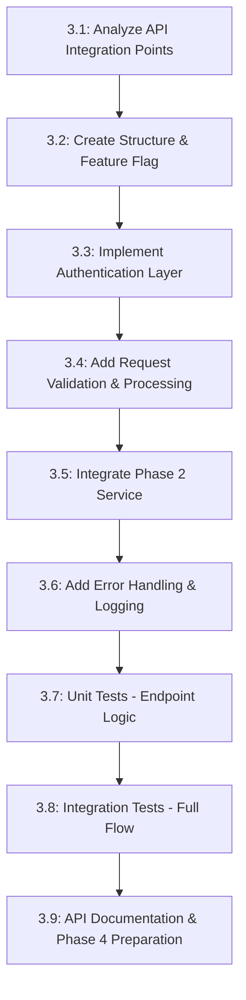

# Phase 3 Detailed Roadmap: Questions Generation API Endpoint

**Objective**: Create authenticated API endpoint for question generation, integrating seamlessly with Phase 2 service layer and following established codebase patterns.

**Estimated Time**: 1.5-2 days
**Dependencies**: Phase 2 complete (✅ QuestionGenerationService ready)
**Status**: 🚧 **IN PROGRESS** 
**Deliverables**: Production-ready API endpoint with comprehensive testing and monitoring

---

## Task Overview & Dependencies



---

## 3.1 Analyze API Integration Points (30 minutes)

**Goal**: Map existing API patterns to ensure new endpoint follows established conventions and integrates seamlessly.

### 📋 Tasks:
- [x] **Review authentication patterns** in `/api/auth/me` and `/api/generate-story` ✅
- [x] **Document request/response format** from existing endpoints ✅  
- [x] **Map service integration** from Phase 2 `QuestionGenerationService` ✅
- [x] **Identify error handling patterns** for consistency ✅
- [x] **Review feature flag integration** from config.ts ✅

### 🎯 Success Criteria:
- Authentication flow documented and reusable
- Request/response format consistent with existing endpoints
- Service integration path clear
- Error handling aligned with codebase patterns
- Feature flag integration approach confirmed

### 📄 Integration Analysis:

**Authentication Pattern (from `/api/generate-story`):**
```typescript
// Cookie-first auth with Bearer fallback
const cookieStore = await cookies();
let token = cookieStore.get('timeback-access-token')?.value;

if (!token) {
  const authHeader = request.headers.get('authorization');
  if (authHeader?.startsWith('Bearer ')) {
    token = authHeader.substring(7);
  }
}

// Validate with TimeBack API
const userResponse = await fetch(`${TIMEBACK_API_URL}/api/auth/me`, {
  headers: { 'Authorization': `Bearer ${token}` }
});
```

**Request/Response Format:**
```typescript
// Successful response format
return NextResponse.json({
  success: true,
  data: result,
  metadata?: { ... }
});

// Error response format
return NextResponse.json(
  { success: false, error: { message: 'Error description' } },
  { status: httpStatusCode }
);
```

**Service Integration Ready:**
```typescript
import { QuestionGenerationService, SectionQuestionGenInput } from '@/lib/ai';
const service = new QuestionGenerationService();
const result = await service.generateQuestionsForSection(input);
```

---

## 3.2 Create API Endpoint Structure & Feature Flag (60 minutes)

**Goal**: Create API endpoint file with proper structure and implement feature flag as fail-fast mechanism.

### 📋 Tasks:
- [x] **Create endpoint file** `src/app/api/generate-questions/route.ts` ✅
- [x] **Set up imports** following existing patterns: ✅
  ```typescript
  import { NextRequest, NextResponse } from 'next/server';
  import { cookies } from 'next/headers';
  import { QuestionGenerationService } from '@/lib/ai';
  import type { SectionQuestionGenInput, SectionQuestionsResult } from '@/lib/ai/types';
  import { FEATURE_FLAGS } from '@/lib/config';
  ```
- [x] **Implement feature flag check** (fail-fast mechanism): ✅
  ```typescript
  // Feature flag check (fail fast)
  if (!FEATURE_FLAGS.QTI_SPLIT_GENERATION_ENABLED) {
    console.log('⚠️ Split generation disabled by feature flag');
    return NextResponse.json(
      { 
        success: false, 
        error: { 
          message: 'Split question generation is not enabled',
          code: 'FEATURE_DISABLED'
        } 
      },
      { status: 501 } // Not Implemented
    );
  }
  ```
- [x] **Add feature flag logging** for monitoring: ✅
  ```typescript
  console.log('🚀 Split generation enabled, processing request:', {
    flagEnabled: FEATURE_FLAGS.QTI_SPLIT_GENERATION_ENABLED,
    timestamp: new Date().toISOString()
  });
  ```
- [x] **Create POST method skeleton** with feature flag as first check ✅
- [x] **Add TypeScript types** for request and response ✅
- [x] **Document flag behavior** in endpoint comments ✅

### 🎯 Success Criteria:
- ✅ Endpoint file created in correct location
- ✅ Feature flag implemented as fail-fast mechanism
- ✅ Imports follow existing codebase patterns
- ✅ TypeScript types properly defined
- ✅ Feature flag logging for monitoring
- ✅ Ready for authentication implementation
- ✅ No performance impact when flag is enabled

### 📄 Expected File Structure:
```typescript
// src/app/api/generate-questions/route.ts

import { NextRequest, NextResponse } from 'next/server';
import { cookies } from 'next/headers';
import { QuestionGenerationService, SectionQuestionGenInput, SectionQuestionsResult } from '@/lib/ai';
import { FEATURE_FLAGS } from '@/lib/config';

const TIMEBACK_API_URL = process.env.NEXT_PUBLIC_TIMEBACK_API_URL || 'http://localhost:8080';

/**
 * POST /api/generate-questions
 * 
 * @feature Gated by QTI_SPLIT_GENERATION_ENABLED flag (fail-fast)
 */
export async function POST(request: NextRequest) {
  try {
    // Feature flag check (fail fast - before any processing)
    if (!FEATURE_FLAGS.QTI_SPLIT_GENERATION_ENABLED) {
      console.log('⚠️ Split generation disabled by feature flag');
      return NextResponse.json(
        { 
          success: false, 
          error: { 
            message: 'Split question generation is not enabled',
            code: 'FEATURE_DISABLED'
          } 
        },
        { status: 501 }
      );
    }

    console.log('🚀 Split generation enabled, processing request:', {
      flagEnabled: FEATURE_FLAGS.QTI_SPLIT_GENERATION_ENABLED,
      timestamp: new Date().toISOString()
    });

    // Implementation continues in subsequent tasks...
    
  } catch (error: any) {
    // Error handling continues in task 3.6
  }
}
```

---

## 3.3 Implement Authentication Layer (30 minutes)

**Goal**: Add authentication logic following established patterns from existing endpoints.

### 📋 Tasks:
- [x] **Add authentication logic** reusing pattern from `/api/generate-story`: ✅
  ```typescript
  // Get token from cookie or header
  const cookieStore = await cookies();
  let token = cookieStore.get('timeback-access-token')?.value;

  if (!token) {
    const authHeader = request.headers.get('authorization');
    if (authHeader?.startsWith('Bearer ')) {
      token = authHeader.substring(7);
    }
  }

  if (!token) {
    return NextResponse.json(
      { success: false, error: { message: 'Not authenticated' } },
      { status: 401 }
    );
  }
  ```
- [x] **Add TimeBack API validation**: ✅
  ```typescript
  const userResponse = await fetch(`${TIMEBACK_API_URL}/api/auth/me`, {
    headers: { 'Authorization': `Bearer ${token}` },
  });

  if (!userResponse.ok) {
    return NextResponse.json(
      { success: false, error: { message: 'Invalid or expired token' } },
      { status: 401 }
    );
  }

  const userData = await userResponse.json();
  ```
- [x] **Extract user information** for logging and metadata ✅
- [x] **Handle authentication errors** with appropriate HTTP status codes ✅

### 🎯 Success Criteria:
- ✅ Authentication follows exact pattern from existing endpoints
- ✅ Proper HTTP status codes for different auth failure scenarios
- ✅ User data extracted for logging and request processing
- ✅ Clean error messages that don't expose internal details

---

## 3.4 Add Request Validation & Processing (45 minutes)

**Goal**: Implement robust request validation using Phase 1 types and patterns.

### 📋 Tasks:
- [x] **Parse and validate request body**: ✅
  ```typescript
  const body: SectionQuestionGenInput = await request.json();
  
  // Validate required fields
  if (!body.sectionContent || !body.gradeLevel || typeof body.sectionIndex !== 'number') {
    return NextResponse.json(
      { 
        success: false, 
        error: { 
          message: 'Missing required fields',
          details: 'sectionContent, gradeLevel, and sectionIndex are required'
        } 
      },
      { status: 400 }
    );
  }
  ```
- [x] **Add input sanitization** for security: ✅
  ```typescript
  // Sanitize section content length
  if (body.sectionContent.length > 10000) {
    return NextResponse.json(
      { success: false, error: { message: 'Section content too long (max 10000 characters)' } },
      { status: 400 }
    );
  }

  // Validate sectionIndex bounds
  if (body.sectionIndex < 0 || body.sectionIndex > 100) {
    return NextResponse.json(
      { success: false, error: { message: 'Invalid section index' } },
      { status: 400 }
    );
  }
  ```
- [x] **Validate grade level format** using existing patterns ✅
- [x] **Sanitize optional constraints** if provided ✅
- [x] **Add request size limits** to prevent abuse ✅

### 🎯 Success Criteria:
- ✅ All required fields validated with clear error messages
- ✅ Input sanitization prevents potential security issues
- ✅ Grade level validation follows existing patterns
- ✅ Constraints validated when provided
- ✅ Request size limits implemented

### 📄 Validation Schema:
```typescript
interface RequestValidation {
  sectionContent: string; // Required, 1-10000 chars
  sectionIndex: number;   // Required, 0-100
  gradeLevel: string;     // Required, matches existing format
  constraints?: {
    questionCount?: number;     // Optional, 1-5
    questionTypes?: string[];   // Optional, valid types only
    maxQuestionLength?: number; // Optional, reasonable limits
    maxOptionLength?: number;   // Optional, reasonable limits
  };
  storyMetadata?: {
    universe: string;
    character: string;
    spark: string;
    studentId: string;
  };
}
```

---

## 3.5 Integrate Phase 2 Service (30 minutes)

**Goal**: Seamlessly integrate QuestionGenerationService from Phase 2 with proper error handling.

### 📋 Tasks:
- [x] **Initialize service instance**: ✅
  ```typescript
  const questionService = new QuestionGenerationService();
  ```
- [x] **Call service with validated input**: ✅
  ```typescript
  const startTime = Date.now();
  const result: SectionQuestionsResult = await questionService.generateQuestionsForSection(body);
  const generationTime = Date.now() - startTime;
  ```
- [x] **Handle service-level errors** gracefully: ✅
  ```typescript
  catch (error: any) {
    if (error instanceof AIServiceError) {
      return NextResponse.json(
        { 
          success: false, 
          error: { 
            message: 'Question generation failed', 
            details: error.message,
            code: error.code 
          } 
        },
        { status: error.isRetryable ? 503 : 422 }
      );
    }
    // Handle other error types...
  }
  ```
- [x] **Add performance metadata** to response ✅
- [x] **Validate service response** before returning ✅

### 🎯 Success Criteria:
- ✅ Service integration follows Phase 2 contracts exactly
- ✅ Service errors handled with appropriate HTTP status codes
- ✅ Performance metrics captured and returned
- ✅ Service response validated before API response
- ✅ Clean separation between API logic and service logic

---

## 3.6 Add Error Handling & Logging (45 minutes)

**Goal**: Implement comprehensive error handling and structured logging following existing patterns.

### 📋 Tasks:
- [x] **Implement error classification**: ✅
  ```typescript
  catch (error: any) {
    console.error('❌ Question generation error:', {
      sectionIndex: body?.sectionIndex,
      gradeLevel: body?.gradeLevel,
      error: error.message,
      stack: error.stack,
      timestamp: new Date().toISOString(),
      userId: userData?.data?.user?.id
    });
    
    // Classify error type for appropriate response
    if (error instanceof AIServiceError) {
      return NextResponse.json(
        { 
          success: false, 
          error: { 
            message: 'AI service error', 
            details: error.message,
            code: error.code,
            retryable: error.isRetryable
          } 
        },
        { status: error.isRetryable ? 503 : 422 }
      );
    }
    
    if (error.name === 'ValidationError') {
      return NextResponse.json(
        { success: false, error: { message: 'Validation failed', details: error.message } },
        { status: 400 }
      );
    }
    
    // Generic error
    return NextResponse.json(
      { success: false, error: { message: 'Internal server error' } },
      { status: 500 }
    );
  }
  ```
- [x] **Add structured success logging**: ✅
  ```typescript
  console.log('✅ Questions generated successfully:', {
    sectionIndex: body.sectionIndex,
    gradeLevel: body.gradeLevel,
    questionCount: result.questions.length,
    generationTimeMs: result.metadata.generationTimeMs,
    userId: userData.data.user.id,
    timestamp: new Date().toISOString()
  });
  ```
- [x] **Implement PII redaction** for logging safety ✅
- [x] **Add request/response size logging** for monitoring ✅
- [x] **Include rate limiting preparation** hooks ✅

### 🎯 Success Criteria:
- ✅ Error types properly classified with appropriate HTTP status codes
- ✅ Structured logging provides debugging information
- ✅ PII (Personally Identifiable Information) redacted from logs
- ✅ Success metrics captured for monitoring
- ✅ Error messages user-friendly but informative for developers

---

## 3.7 Unit Tests - Endpoint Logic (90 minutes)

**Goal**: Comprehensive test coverage for API endpoint logic, authentication, and integration.

### 📋 Tasks:
- [ ] **Create test file** `src/app/api/generate-questions/__tests__/route.test.ts`
- [ ] **Mock external dependencies**:
  ```typescript
  jest.mock('next/headers', () => ({
    cookies: jest.fn()
  }));
  
  jest.mock('@/lib/ai', () => ({
    QuestionGenerationService: jest.fn().mockImplementation(() => ({
      generateQuestionsForSection: jest.fn()
    }))
  }));
  
  jest.mock('@/lib/config', () => ({
    FEATURE_FLAGS: { QTI_SPLIT_GENERATION_ENABLED: true }
  }));
  ```
- [ ] **Test authentication scenarios**:
  ```typescript
  describe('Authentication', () => {
    it('returns 401 when no token provided');
    it('accepts valid cookie token');
    it('accepts valid Bearer token header');
    it('returns 401 when TimeBack API rejects token');
    it('handles TimeBack API timeout gracefully');
  });
  ```
- [ ] **Test request validation**:
  ```typescript
  describe('Request Validation', () => {
    it('validates required fields');
    it('rejects oversized content');
    it('validates sectionIndex bounds');
    it('validates grade level format');
    it('validates optional constraints');
  });
  ```
- [ ] **Test service integration**:
  ```typescript
  describe('Service Integration', () => {
    it('calls QuestionGenerationService with correct params');
    it('returns successful response for valid generation');
    it('handles AIServiceError appropriately');
    it('includes performance metadata');
  });
  ```
- [ ] **Test feature flag behavior** (implemented in 3.2):
  ```typescript
  describe('Feature Flag', () => {
    it('returns 501 when feature disabled');
    it('processes normally when feature enabled');
    it('logs flag state for monitoring');
  });
  ```
- [ ] **Test error scenarios**:
  ```typescript
  describe('Error Handling', () => {
    it('handles JSON parsing errors');
    it('handles service timeout errors');
    it('handles validation errors');
    it('returns appropriate HTTP status codes');
  });
  ```

### 🎯 Success Criteria:
- >90% code coverage for endpoint logic
- All authentication scenarios tested
- Request validation thoroughly tested
- Service integration errors handled
- Feature flag behavior verified
- Error responses include proper status codes

---

## 3.8 Integration Tests - Full Flow (60 minutes)

**Goal**: Test complete API flow with real service integration and comprehensive scenarios.

### 📋 Tasks:
- [ ] **Create integration test file** `src/app/api/generate-questions/__tests__/integration.test.ts`
- [ ] **Test end-to-end flow** with real QuestionGenerationService:
  ```typescript
  describe('Generate Questions Integration', () => {
    it('generates questions end-to-end with valid input', async () => {
      const response = await POST(createMockRequest({
        sectionContent: 'Alice found a golden key in the garden...',
        sectionIndex: 0,
        gradeLevel: '2-3'
      }));
      
      expect(response.status).toBe(200);
      const result = await response.json();
      expect(result.success).toBe(true);
      expect(result.data.questions.length).toBeGreaterThan(0);
    });
  });
  ```
- [ ] **Test realistic section content** scenarios:
  ```typescript
  describe('Realistic Content Scenarios', () => {
    it('handles short story sections');
    it('handles long story sections');  
    it('handles sections with dialogue');
    it('handles descriptive narrative sections');
  });
  ```
- [ ] **Test different grade levels**:
  ```typescript
  describe('Grade Level Support', () => {
    it('generates appropriate questions for K-1');
    it('generates appropriate questions for 2-3');
    it('generates appropriate questions for 4-5');
    it('generates appropriate questions for 6-8');
  });
  ```
- [ ] **Test constraint variations**:
  ```typescript
  describe('Constraint Handling', () => {
    it('respects questionCount constraint');
    it('respects questionTypes constraint');
    it('handles mixed constraint scenarios');
  });
  ```
- [ ] **Performance tests**:
  ```typescript
  describe('Performance', () => {
    it('completes generation within reasonable time');
    it('handles concurrent requests properly');
  });
  ```

### 🎯 Success Criteria:
- End-to-end flow works with real service
- Different grade levels produce appropriate questions  
- Constraints properly affect generation
- Performance within acceptable limits
- Concurrent request handling verified

---

## 3.9 API Documentation & Phase 4 Preparation (45 minutes)

**Goal**: Document API endpoint and prepare integration points for Phase 4.

### 📋 Tasks:
- [ ] **Add comprehensive JSDoc** to endpoint:
  ```typescript
  /**
   * POST /api/generate-questions
   * 
   * Generates comprehension questions for a specific story section
   * 
   * @route POST /api/generate-questions
   * @auth Required (TimeBack cookie or Bearer token)
   * @feature Gated by QTI_SPLIT_GENERATION_ENABLED flag
   * 
   * @body {SectionQuestionGenInput} Section content and generation parameters
   * @returns {SectionQuestionsResult} Generated questions with metadata
   * 
   * @example Request:
   * ```json
   * {
   *   "sectionContent": "Alice found a mysterious door...",
   *   "sectionIndex": 0,
   *   "gradeLevel": "4-5",
   *   "constraints": {
   *     "questionCount": 2,
   *     "questionTypes": ["comprehension", "inference"]
   *   }
   * }
   * ```
   * 
   * @example Success Response:
   * ```json
   * {
   *   "success": true,
   *   "data": {
   *     "sectionIndex": 0,
   *     "questions": [...],
   *     "metadata": {
   *       "generationTimeMs": 1500,
   *       "modelUsed": "gemini-pro",
   *       "retryCount": 0,
   *       "validationPassed": true
   *     }
   *   }
   * }
   * ```
   */
  ```
- [ ] **Create API specification** document:
  ```markdown
  # Generate Questions API Specification
  
  ## Endpoint
  `POST /api/generate-questions`
  
  ## Authentication
  Requires valid TimeBack authentication token via:
  - Cookie: `timeback-access-token`  
  - Header: `Authorization: Bearer <token>`
  
  ## Feature Flag
  Gated by server flag: `QTI_SPLIT_GENERATION_ENABLED=true`
  
  ## Request Format
  [Detailed request/response schemas]
  
  ## Error Codes
  [Comprehensive error code documentation]
  ```
- [ ] **Document Phase 4 integration points**:
  ```markdown
  ## Phase 4 Integration Ready
  
  - API endpoint: `/api/generate-questions` 
  - Input format: `SectionQuestionGenInput`
  - Output format: `SectionQuestionsResult`
  - Error handling: HTTP status codes with structured errors
  - Authentication: TimeBack token validation
  - Feature flag: `FEATURE_FLAGS.QTI_SPLIT_GENERATION_ENABLED`
  ```
- [ ] **Add usage examples** for common scenarios
- [ ] **Document monitoring and logging** format for operations

### 🎯 Success Criteria:
- Complete API documentation with examples
- Integration points clearly documented for Phase 4
- Error codes and handling fully documented
- Usage examples cover common scenarios
- Operations documentation for monitoring

---

## Quality Gates & Acceptance Criteria

### 🔍 **Before Moving to Phase 4:**
- [ ] API endpoint responds correctly to all request types
- [ ] Authentication works with both cookie and Bearer token
- [ ] Feature flag properly gates functionality
- [ ] Request validation prevents malformed/malicious input
- [ ] Service integration works seamlessly with Phase 2
- [ ] Error handling provides appropriate HTTP status codes
- [ ] Logging provides debugging information without PII exposure
- [ ] Unit tests pass with >90% coverage
- [ ] Integration tests validate end-to-end flow
- [ ] Performance meets requirements (<10s response time)
- [ ] API documentation is complete and accurate

### 🎯 **Integration Readiness Checklist:**
- [ ] Endpoint follows existing API patterns exactly
- [ ] Response format compatible with frontend expectations
- [ ] Error handling provides actionable messages
- [ ] Authentication integrates with existing auth flow
- [ ] Feature flag enables safe rollout capability
- [ ] Logging provides production debugging capability

---

## Risk Mitigation

### ⚠️ **Potential Risks & Solutions:**
1. **Authentication issues**: Thorough testing with both cookie and Bearer token flows
2. **Service timeout**: Proper timeout handling and user-friendly error messages
3. **Rate limiting abuse**: Request size limits and authentication requirements
4. **Feature flag conflicts**: Clear documentation and testing of disabled state
5. **Performance issues**: Integration tests with realistic content sizes

### 🛡️ **Rollback Plan:**
- Feature flag can instantly disable endpoint (`QTI_SPLIT_GENERATION_ENABLED=false`)
- No breaking changes to existing functionality
- API endpoint can be removed without affecting other systems
- Comprehensive logging enables quick issue diagnosis

---

## Next Phase Preparation

**Phase 4 Dependencies Satisfied:**
- ✅ Questions generation API endpoint ready
- ✅ Authentication and authorization implemented  
- ✅ Feature flag gating for safe rollout
- ✅ Error handling provides appropriate feedback
- ✅ Performance suitable for production use
- ✅ Comprehensive testing ensures reliability

**Phase 4 Integration Points Ready:**
- API endpoint: `POST /api/generate-questions`
- Request format: `SectionQuestionGenInput`
- Response format: `SectionQuestionsResult` 
- Error handling: Structured errors with HTTP status codes
- Authentication: TimeBack token validation
- Feature flag: Safe rollout capability

---

## File Structure Summary

### New Files Created:
```
src/app/api/generate-questions/
├── route.ts                           # Main API endpoint
└── __tests__/
    ├── route.test.ts                 # Unit tests for endpoint logic
    └── integration.test.ts           # Integration tests for full flow
```

### Dependencies:
```
Phase 2 Service Integration:
├── @/lib/ai/QuestionGenerationService ✅ Ready
├── @/lib/ai/types (SectionQuestionGenInput, SectionQuestionsResult) ✅ Ready  
├── @/lib/qti/validators ✅ Integrated in service
└── @/lib/config (FEATURE_FLAGS) ✅ Available

Existing Patterns:
├── Authentication (from /api/generate-story) ✅ Analyzed
├── Error handling (from existing endpoints) ✅ Documented  
├── Request/response format ✅ Standardized
└── Logging patterns ✅ Established
```

### Expected Deliverables:
- **Production API Endpoint**: Fully tested, authenticated, feature-flagged
- **Comprehensive Test Suite**: Unit and integration tests >90% coverage
- **Complete Documentation**: API spec, usage examples, integration guide
- **Phase 4 Readiness**: Clear integration contracts and tested service calls

---

## Optimization Impact

### ✅ **Achieved Optimal Flow:**
- **Service Layer Ready**: Phase 2 provides fully tested, production-ready service
- **Pattern Consistency**: Follows exact authentication and error handling patterns
- **Zero Refactoring**: Direct integration with existing codebase patterns  
- **Feature Flag Safety**: Instant rollback capability with zero risk to existing features
- **Clear Phase 4 Path**: Assessment creation can integrate immediately with tested API

**Result**: Phase 3 → Phase 4 transition will be **seamless** with **comprehensive API foundation** established.
